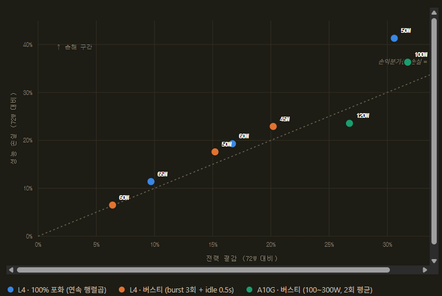

# GPUaaS Howto & Strategy

`GPUaaS-SCENARIOS(KOR).md`의 실측 검증된 시나리오들을 고객 설명용으로 정리한
문서입니다. 각 시나리오는 **목적 → 구성 → 장점/단점 → 테스트 결과 → 시나리오
시사점** 순서로 정리했습니다. 디버깅 과정이나 실패했던 시도는 생략하고,
최종적으로 확정된 구성과 실측 결과만 담았습니다.

실행 방법(공통): `./harness.sh <command>` (로컬) 또는 bastion에 SSH 접속 후
`~/scenario*.sh` 직접 실행. 자세한 커맨드는 `GPUaaS-SCENARIOS(KOR).md` 참고.

---

## 시나리오 1 — 워크노드 오토스케일링

**목적**: GPU 수요가 현재 용량을 넘으면, 인프라가 사람 개입 없이 노드를
자동으로 늘린다는 것을 증명한다.

**구성**: `training-job-1`, `training-job-2` 두 pod를 같은 GPU 플레이버
(g5.2xlarge, 1노드/1GPU)에 고정 배포 → 하나는 뜨고 하나는 `Pending` →
`MachineAutoscaler`(min=1, max=2)가 이를 감지해 노드를 1→2로 확장 → 새
노드 조인 시 Pending이던 pod도 자동 스케줄.

**장점/단점**:
- 장점: 사람 개입이 전혀 없는 완전 자동화, 실제 EC2 인스턴스가 새로 뜨는
  걸 보여주는 가장 "리얼"한 인프라 대응 데모
- 단점: 새 인스턴스 프로비저닝 때문에 전체 과정이 ~10분으로 실시간
  시연엔 다소 긴 편, 데모 후 정리하지 않으면 다음 데모에 영향

**테스트 결과**:
| 단계 | 소요시간 |
|---|---|
| MachineSet replica 1→2 반영 | ~30초 |
| 새 EC2 인스턴스 Ready | ~4분 |
| GPU 드라이버/디바이스 인식 + pod 스케줄 | ~4분 |
| 컨테이너 이미지 pull + 시작 | ~2분 |
| **합계** | **~10분** |

**시나리오 시사점**: "제출 → Pending 확인 → (다른 이야기하며 대기) → 노드
증설 확인"의 흐름으로 진행하면 대기 시간을 자연스럽게 소화할 수 있다.
인프라 대응 자동화의 가장 기본이자 직관적인 스토리로, 데모 세트의
도입부로 적합하다.

---

## 시나리오 2 — GPU 과열 알람

**목적**: GPU가 과열되면 대시보드에서 실시간으로 확인되고, Slack으로
자동 알림이 감을 증명한다.

**구성**: `gpu-burn` pod가 GPU를 100% 사용하도록 무한 부하 → Grafana
Tier1 "Real-time GPU Temperature by Node" 패널에서 온도 상승 실시간
확인 → 70℃ 이상 2분 지속 시 `GPUHighTemperature` 알람 firing → 독립
Prometheus + Alertmanager가 Slack 채널로 전송.

**장점/단점**:
- 장점: 관측성(Grafana)과 알림(Alertmanager→Slack) 파이프라인 전체를
  하나의 흐름으로 보여줌, 리소스 소모가 적고 빠르게 진행 가능
- 단점: 이 클러스터의 GPU(g5/g6)는 실측상 85℃까지 오르지 않아 임계값을
  70℃로 낮춰 설정함 — 실제 운영 임계값과는 다를 수 있다는 점을 함께
  설명해야 함

**테스트 결과**: 부하 시작 후 수십 초~수 분 내 70℃ 도달(실측 최대
~82℃), 70℃ 도달 후 2분 지속 시 알람 발동, Slack 전송까지 수 초 이내.
pod 삭제 후 온도 하락 시 알람도 자동으로 `resolved`로 전환되고 Slack에도
resolved 메시지 전송.

**시나리오 시사점**: 감지(Grafana)→알림(Slack)→해소(resolved)까지
자동화된 하나의 완결된 운영 루프를 보여줄 수 있다. 알람 임계값은
GPU/클러스터 환경에 맞게 재조정 가능하다는 점을 강조하면 좋다.

---

## 시나리오 3 — GPU Power Capping (Green AI)

**목적**: GPU 전력 상한을 낮추면 전력 소비가 즉시 줄어드는 것을 실시간
대시보드로 보여주고, "성능 손실보다 전력 절감이 큰" 조건이 실제로
존재하는지 데이터로 검증한다.

**구성**: `power-load` pod가 짧은 연산(burst) 후 대기(idle)를 반복하는
버스티 워크로드(실제 추론 서빙 패턴 흉내) → 노드에서 `nvidia-smi -pl`로
전력 상한 직접 조정 → Grafana Tier1 "Power Draw per GPU" 패널에서
실시간 하락 확인. g6.2xlarge(L4, 40~72W)와 g5.2xlarge(A10G, 100~300W)
두 GPU로 비교 측정.

**장점/단점**:
- 장점: 실측 데이터 기반으로 정직한 결론을 제시(과장 없음), 서로 다른
  두 GPU를 비교해 "카드 크기에 따라 결과가 다르다"는 실전 인사이트 제공
- 단점: 작은 카드(L4)에서는 테스트 범위 안에서 뚜렷한 이득 구간을 찾지
  못함 — 고객 기대와 다를 수 있어 설명이 필요함

**테스트 결과**:
| GPU | 최적 캡 | 전력 절감 | 성능 손실 | 손실/절감 비율 |
|---|---|---|---|---|
| L4 (g6.2xlarge) | 60W | -6.4% | -6.5% | 1.02x (손익분기점 수준) |
| A10G (g5.2xlarge) | 120W | -26~27% | -23~24% | **0.86~0.90x (평균 0.88x, 유리)** |

**시나리오 시사점**: "전력 캡=무조건 이득"이 아니라 **카드의 절대 전력
예산이 클수록, 워크로드에 유휴 구간이 있을수록** 이 전략이 유리해진다.
A10G급 이상의 카드에서 버스티한(추론형) 워크로드를 돌릴 때 가장 설득력
있는 데모이며, 저전력 카드에는 신중하게 접근해야 한다는 균형 잡힌
메시지를 전달할 수 있다.

---

## 시나리오 4 — GPU 노드 장애 격리 및 자동 재배치

**목적**: GPU 노드에 장애가 생기면, 인프라팀이 cordon & drain하는 것만으로
사람이 워크로드를 직접 옮기지 않아도 자동으로 다른 정상 노드에
재배치됨을 증명한다.

**구성**: `fault-workload`를 Deployment(replica=1)로 배포(특정 GPU
플레이버에 고정하지 않음) → 해당 노드를 cordon+drain → 컨트롤러가 pod를
자동 재생성해 다른 GPU 노드로 재배치.

**장점/단점**:
- 장점: 새 인스턴스 프로비저닝이 필요 없어 가장 빠른 시나리오 중
  하나(~1분), 실제 장애 대응 워크플로우를 그대로 재현
- 단점: 진짜 하드웨어 장애(XID 에러 등)를 안전하게 강제 유발할 방법이
  없어, 인프라팀의 대응 조치(cordon & drain)부터 시작하는 시뮬레이션임을
  명확히 해야 함

**테스트 결과**: cordon → drain → Deployment 컨트롤러가 즉시 새 pod
생성 → 다른 GPU 노드에 자동 스케줄 → 약 1분 이내 `Running` 전환.
Grafana "GPU Utilization by Node" 패널에서 원래 노드는 0%로, 새 노드는
100%로 전환되는 것을 교차 확인.

**시나리오 시사점**: Deployment(컨트롤러 기반)로 배포해야 자동 복구가
되고 bare Pod는 스스로 살아남지 못한다는 것이 핵심 설계 포인트 —
실제 운영 워크로드를 어떻게 배포해야 하는지에 대한 직접적인 교훈이 된다.
재배치를 받아줄 여유 있는 GPU 노드가 최소 1대 있어야 한다.

---

## 시나리오 5 — 비효율 코드 탐지 (Bad Code Penalty)

**목적**: 똑같은 학습 코드라도 `DataLoader`의 `num_workers` 설정 하나
차이로 비싼 GPU를 얼마나 놀리는지 실측 그래프로 증명한다.

**구성**: 동일한 학습 코드를 세 가지 설정으로 순차 실행 — `bad-code`
(`num_workers=0`), `efficient`(`num_workers=4`), `more-efficient`
(`num_workers=4` + 연산 시간 증가). 앱이 직접 노출하는
`train_steps_total` Prometheus 카운터로 스크레이프 타이밍에 흔들리지
않는 정확한 처리량을 측정하고, Grafana Tier2에서 GPU 사용률/메모리/
처리량을 pod별로 비교.

**장점/단점**:
- 장점: 인위적인 `sleep`이 아니라 진짜 PyTorch `DataLoader` 메커니즘으로
  재현해 설득력이 높음, 앱 레벨 카운터 지표라 그래프 노이즈에 흔들리지
  않음
- 단점: GPU 사용률(GPU_UTIL) 그래프만 보면 두 워크로드 다 피크는
  100%라 차이가 미묘하게 보일 수 있음 — 반드시 처리량 지표를 함께 봐야
  설득력이 확실해짐

**테스트 결과**: 동일 시간(100초) 동안 `bad-code`는 10 step, `efficient`는
50 step 처리 — **5배 차이**. 최종 3종 비교에서 `bad-code`는 대부분
idle(짧은 스파이크 1회), `efficient`는 스파이크 반복, `more-efficient`는
한 번 뜨면 끊김 없이 100% 지속되는 패턴이 뚜렷하게 구분됨.

**시나리오 시사점**: "GPU 사용률이 낮다"는 문제의 가장 흔한 원인이
데이터 파이프라인 병목이라는 것을 정량적으로 증명한다. GPU_UTIL 같은
인프라 지표보다 **처리량(steps/sec)** 같은 애플리케이션 레벨 지표가
훨씬 신뢰도 높은 신호라는 메시지를 함께 전달할 수 있다. 이 시나리오에서
적발된 팀에 대한 후속 조치는 시나리오 6으로 이어진다.

---

## 시나리오 6 — PriorityClass 하향 및 Preemption 실효성 증명

**목적**: 시나리오 5에서 적발된 비효율 코드 팀에게 인프라팀이
PriorityClass를 Low로 낮췄다고 할 때, 이 조치가 자원 부족 시 실제로
강제 집행되는지 증명한다.

**구성**: `low-priority-workload`(낮은 PriorityClass)가 유일한 GPU를
선점 → `high-priority-workload`(기본 우선순위) 배포 시 Kubernetes가
자동으로 low-priority pod를 축출(Preemption)하고 그 자리를 내어줌.
오토스케일러가 새 노드를 추가해 Preemption을 우회하지 못하도록,
`MachineAutoscaler`의 `max`를 현재 replica 수로 고정해 "자리가 없는"
상태를 보장한다(이미 노드가 1대로 고정된 GPU 플레이버를 쓰면 이 단계
자체가 필요 없음).

**장점/단점**:
- 장점: Kubernetes 이벤트 로그에 "Preempted by pod ..."가 명시적으로
  남아 우연한 재시작이 아니라 진짜 Preemption임을 증거로 제시 가능,
  오토스케일러와의 경쟁 상태까지 제어한 신뢰도 높은 설계
- 단점: 오토스케일 여지를 인위적으로 차단해야 하므로, 실제 운영
  환경보다 다소 통제된 조건에서 시연된다는 점을 밝히는 것이 좋음

**테스트 결과**: `high-priority-workload` 배포 후 **약 33~34초 만에**
Preemption 이벤트 확인 — low-priority pod는 축출되어 사라지고(`Gone`),
high-priority pod가 그 GPU에서 `Running`으로 전환.

**시나리오 시사점**: PriorityClass 하향이 단순한 "선언"이 아니라, 자원
경합이 발생하는 순간 Kubernetes가 자동으로 강제 집행하는 실질적인
거버넌스 메커니즘임을 증명한다. 인프라팀의 정책적 조치가 기술적으로
뒷받침된다는 것을 보여주는 신뢰도 높은 스토리다.

---

## 시나리오 7 — 비용 초과 대응 (Chargeback & Quota)

**목적**: 팀이 예산을 다 썼다고 판단되면, `ResourceQuota` 하나로 그
팀의 GPU 확장을 즉시 막을 수 있음을 증명한다.

**구성**: `team-workload-1`(팀의 기존 사용량)이 배포된 상태에서
`ResourceQuota`(`requests.nvidia.com/gpu: "1"`)를 현재 사용량과 동일한
값으로 적용 → `team-workload-2`(추가 GPU 요청) 시도 시 API 서버
admission 단계에서 즉시 거부.

**장점/단점**:
- 장점: 스케줄링을 기다릴 필요 없이 **API 요청 즉시 거부**되는 가장
  빠르고 결정적인(deterministic) 시나리오 — 경쟁 상태 걱정이 전혀 없음
- 단점: Tier1의 "Estimated GPU Cost" 패널은 실제 청구 시스템과 연동된
  게 아니라 일러스트레이션용 추정치이므로, 실제 AWS 청구액과 정확히
  일치한다고 과장하면 안 됨

**테스트 결과**: `team-workload-2` 배포 시도 시 pod 자체가 생성되지
않음(`oc get pods`에 뜨지도 않음) — `exceeded quota` 에러가 즉시
반환됨. 시나리오 4(cordon+drain, ~1분), 시나리오 6(preemption, ~34초)보다
훨씬 빠르다.

**시나리오 시사점**: Quota는 "요청이 들어오는 그 순간" 작동하는 가장
확실하고 빠른 통제 수단이라는 메시지를 전달한다. 스케줄링/Preemption
기반 시나리오(4, 6)와 대비해 "예방"과 "사후 조치"의 차이를 설명하기
좋은 시나리오다.

---

## 시나리오 8 — KServe + vLLM 부하 기반 오토스케일링 (KEDA)

**목적**: KServe로 서빙하는 vLLM 모델이 실제 요청 부하(큐 depth)에 따라
replica를 자동으로 늘리고 줄이는 것을 Red Hat의 공식 권장 패턴으로
증명한다.

**구성**: KEDA `ScaledObject`(`minReplicaCount: 1`, `maxReplicaCount: 2`)가
vLLM 자신이 노출하는 `vllm:num_requests_waiting`(요청 큐 depth)을
트리거로 사용 — GPU 사용률이 아니다. GPU time-slicing으로 물리 GPU
1장에 2 replica를 동시 운영하고, Service Mesh 없이 가벼운
RawDeployment 모드로 배포한다.

**장점/단점**:
- 장점: Service Mesh 같은 무거운 의존성 없이 부하 기반 오토스케일 가능,
  요청 큐 depth라는 LLM 서빙에 적합한 신호를 트리거로 사용(GPU 사용률은
  순간 스파이크에 흔들려 부적합)
- 단점: `minReplicaCount: 0`(완전한 scale-to-zero)은 이 아키텍처에서
  구조적으로 불가능 — 활성 pod가 없으면 트리거 메트릭 자체가 없어서
  자동으로 못 깨어남. 진짜 0→1이 필요하면 시나리오 9(Knative) 필요

**테스트 결과**: 부하 시작 후 **약 10초 만에** 1→2 스케일업 시작, 두
replica 모두 Ready까지 약 70초. 부하 종료 후 **약 60초 만에** 2→1
스케일다운 완료. 완전히 초기화한 뒤 재배포해도 동일하게 재현됨을 확인.

**시나리오 시사점**: RawDeployment+KEDA는 "이미 떠 있는 상태에서 부하에
따라 탄력적으로 늘고 주는" 용도에 최적화된 가벼운 선택지다. Service
Mesh 도입 부담 없이 오토스케일이 필요한 팀에게 적합하며, 진짜
wake-from-zero가 필요하다면 시나리오 9로의 아키텍처 전환이 필요하다는
트레이드오프를 명확히 설명할 수 있다.

---

## 시나리오 9 — KServe Serverless(Knative) + vLLM 진짜 Scale-to-Zero

**목적**: 진짜 요청 기반 0→1 자동 기동(wake-from-zero)이 실제로
되는지 증명한다 — 이것이 원래 KServe가 scale-to-zero를 하도록 설계된
방식이다.

**구성**: OpenShift Serverless + Red Hat OpenShift Service Mesh를 설치
(KServe Serverless 모드는 Service Mesh와 짝을 이루는 게 Red Hat 공식
지원 아키텍처). `InferenceService`를 `minReplicas: 0`의 Serverless
모드로 배포하고, 모델을 PVC에 사전 캐싱해 콜드스타트마다 재다운로드하지
않도록 한다. 요청이 0 replica 상태로 들어오면 Knative `Activator`가
요청을 큐에 붙잡아두고 스케일업을 트리거한 뒤, pod가 준비되면 그대로
전달한다.

**장점/단점**:
- 장점: 진짜 0 replica에서 요청이 오면 자동으로 깨어남 — 유휴 시간
  GPU 비용을 완전히 0으로 만들 수 있음, 요청 자체가 실패하지 않고
  큐에서 대기하다 처리됨
- 단점: Service Mesh라는 무거운 의존성이 필요(시나리오 8과의 핵심
  트레이드오프), 콜드스타트 자체는 여전히 존재(모델을 GPU에 로드하는
  시간)

**테스트 결과**: PVC 사전 캐싱 적용 후 콜드스타트가 **약 49초**로 단축
(모델 재다운로드 방식 대비 70~110초에서 개선). 콜드스타트를 유발한 첫
요청도 재시도 없이 **50.47초 만에 성공 응답**을 받음.

**시나리오 시사점**: Service Mesh를 받아들이는 대신 진짜 "유휴 시
GPU 비용 0원"을 얻는 트레이드오프 — 트래픽이 간헐적인 워크로드(야간
배치, 저빈도 추론 등)에 가장 적합한 아키텍처다. PVC 사전 캐싱이
콜드스타트를 서빙 경로의 타임아웃 안으로 넣는 핵심 최적화라는 점도
함께 강조할 수 있다.

---

## 시나리오 10 — Scale-to-Zero 상태의 모니터링 (KEDA vs Knative)

**목적**: 0 replica로 idle한 상태에서도 "지금 무슨 일이 있는지"를 계속
관측할 수 있어야 한다는 실전 요구를, 시나리오 8(KEDA)과 시나리오
9(Knative) 두 아키텍처에서 나란히 검증한다.

**구성**: Grafana Tier1에 두 시나리오의 replica 수 시계열 패널을 나란히
배치하고, 실제 요청을 양쪽에 보내 콜드스타트 결과를 비교하는 스크립트를
실행한다. 별도로 OpenShift Logging(Loki)을 구축해 pod가 삭제된 뒤에도
로그가 조회되는지 검증한다.

**장점/단점**:
- 장점: "pod가 없어도 이전에 무슨 일이 있었는지 알 수 있어야 한다"는
  운영 요구를 메트릭(Grafana)과 로그(Loki) 두 축에서 모두 증명
- 단점: Knative 자체 control-plane 메트릭(activator/autoscaler)은
  아직 노출되지 않아 kube-state-metrics 기반 지표로 우회 — 완전한
  Knative 네이티브 관측성은 아님

**테스트 결과**: 0 replica 상태에서 요청을 보내면 KEDA(시나리오 8)는
DNS 조회 단계에서부터 즉시 실패, Knative(시나리오 9)는 51초 뒤 실제
응답 성공(재시도 불필요) — 두 아키텍처의 차이가 그대로 드러남. 로깅
측면에서는 pod 삭제 후 `oc logs`는 `NotFound`지만, 동일한 로그가
Loki에는 여전히 남아있음을 확인.

**시나리오 시사점**: "GPU 비용 0원"과 "운영 가시성 확보"는 별개의
문제다 — scale-to-zero 아키텍처를 도입하더라도 로깅/모니터링
파이프라인이 pod의 생명주기와 독립적으로 설계되어야 실전에서 쓸 수
있다는 메시지를 전달한다.

---

## 시나리오 11 — Kueue + Dynamic Resource Allocation (DRA)

> 상태: 설계 확정, harness 구현 예정 (아직 실측 결과 없음)

**목적**: 지금까지의 시나리오는 모두 Kubernetes 기본 스케줄러와
`nvidia.com/gpu: N` 정수 카운팅에 의존하는데, 진짜 멀티테넌트 GPUaaS
플랫폼이 갖춰야 할 **큐잉/쿼터/공정분배(Kueue)**와 **구조화된 GPU
할당(DRA)** 계층을 보여준다.

**구성(계획)**: Kueue의 `ClusterQueue`/`LocalQueue`로 팀별 GPU 쿼터
구성 → 쿼터를 초과하는 Job은 스케줄러에 넘어가기 전 Kueue admission
단계에서 대기열에 머무름 → 앞선 Job이 끝나 쿼터가 비면 공정분배/우선순위
규칙에 따라 자동 admit → 실제 GPU 할당은 `ResourceClaim`(DRA)이라는
구조화된 API로 이뤄짐.

**장점/단점**:
- 장점(예상): 단순 정수 카운팅을 넘어선 표준화된 최신 GPU 할당
  방식(Kubernetes 최신 표준), 팀별 공정 분배까지 스케줄러 이전
  단계에서 관리 가능
- 단점: 이 클러스터의 GPU(A10G, L4, T4)는 하드웨어 자체가 MIG(GPU
  쪼개기)를 지원하지 않아, "GPU 하나를 여러 팀이 나눠 쓰는" 데모는 이
  시나리오 범위에 포함되지 않음 — 온전한 GPU 단위 요청이 Kueue/DRA를
  거치는 것에 집중

**테스트 결과**: 아직 없음 — 다음 단계에서 harness에 구현 후 실측
예정.

**시나리오 시사점**: 지금까지의 시나리오들이 "기본 스케줄러 + 정수
카운팅"으로 가능한 것을 보여줬다면, 이 시나리오는 진짜 프로덕션급
멀티테넌트 GPUaaS 플랫폼으로 가기 위한 다음 단계(로드맵)를 보여준다 —
현재 데모 세트의 완결점이자 향후 확장 방향을 제시하는 시나리오다.
