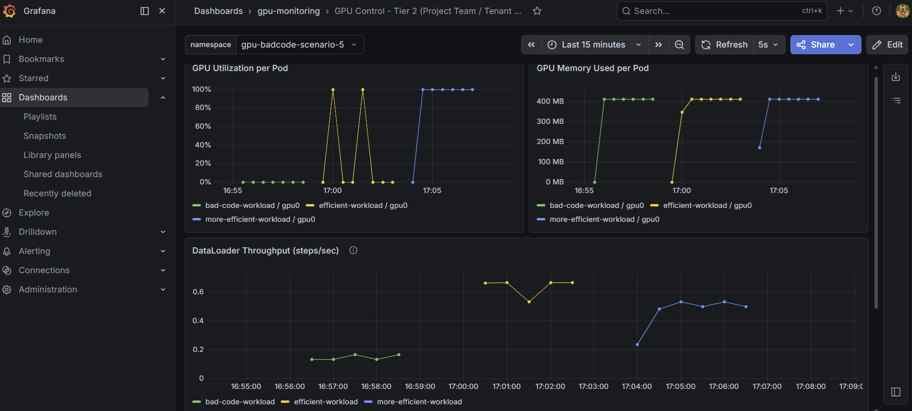
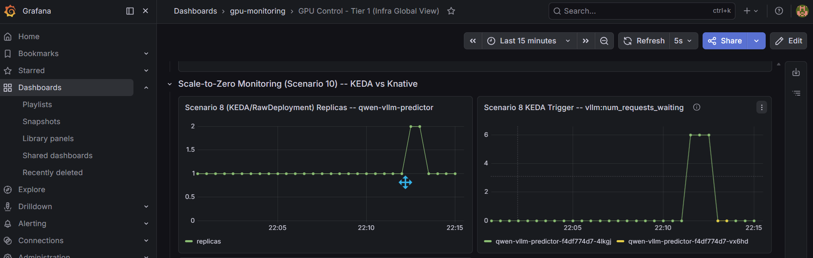

# GPU 데모 시나리오

`myocp` 클러스터(OpenShift + OpenShift AI + GPU Operator + 모니터링 스택)가 이미
구축되어 있다는 전제 하에, 고객 데모용으로 준비된 시나리오들을 순서대로 정리한
문서입니다. 번호는 **발표 순서** 기준이며, `openshift-monitoring` 문서 자체의
시나리오 번호(1: 과열/장애, 2: GPU 오남용, 3: 비효율 코드, 4: Chargeback)와는
다릅니다 — 이 데모의 "시나리오 2(알람)"와 "시나리오 4(장애 격리)"가 둘 다
문서상으로는 "시나리오 1"의 감지/조치 부분에 해당하고(하나는 감지+알림,
하나는 조치), "시나리오 3(Power Capping)"은 문서의 별도 섹션인 "Green AI",
"시나리오 5·6(비효율 코드 탐지 + PriorityClass/Preemption)"은 둘 다 문서의
"시나리오 3"의 감지/조치 부분에, "시나리오 7(Chargeback & Quota)"은 문서의
"시나리오 4"에 해당합니다.

실행은 두 가지 방법 모두 가능합니다:
- 로컬에서 `./harness.sh <command>` (harness 체크아웃 + AWS 프로필 필요)
- bastion에 SSH 접속 후 `~/scenario*.sh` 직접 실행 (가장 빠름, 데모 중 추천)

```bash
ssh -i ~/.ssh/myocp-bastion ec2-user@<bastion-public-ip>
```

---

## 시나리오 1 — 워크노드 오토스케일링

**보여주는 것**: GPU 수요가 현재 용량을 넘으면, 인프라가 사람 개입 없이 노드를
자동으로 늘린다.

**구성**:
- `training-job-1`, `training-job-2` 두 개의 pod를 **같은 GPU 플레이버**
  (`g5.2xlarge`, NVIDIA A10G)에 고정해서 배포
- 각 pod는 `nvidia.com/gpu: 1` 요청 — 그런데 g5 MachineSet은 현재 1노드/1GPU뿐
- 하나는 뜨고, 하나는 `Pending` (`Insufficient nvidia.com/gpu`)
- `MachineAutoscaler`(min=1, max=2)가 이를 감지해서 g5 MachineSet을 1→2로 확장
- 새 노드가 조인하면 Pending이던 pod도 스케줄됨

**실행**:
```bash
# bastion에서
~/scenario1-autoscale-start.sh

# 또는 로컬에서
./harness.sh scenario1-autoscale-demo
```

**지켜볼 것**:
```bash
oc get pods -n gpu-autoscale-scenario-1 -o wide -w
oc get machineset -n openshift-machine-api | grep g5-2xlarge
```

**타이밍** (실측):
| 단계 | 소요시간 |
|---|---|
| MachineSet replica 1→2 반영 | ~30초 |
| 새 EC2 인스턴스 Ready | ~4분 |
| GPU 드라이버/디바이스 인식 + pod 스케줄 | ~4분 |
| 컨테이너 이미지 pull + 시작 | ~2분 |
| **합계** | **~10분** |

10분은 실시간으로 지켜보기엔 길어서, "제출 → Pending 확인 → (다른 얘기 하는 동안 대기) → 노드 늘어난 거 확인" 식으로 진행 추천.

**정리 (데모 후 반드시 실행)**:
```bash
~/scenario1-autoscale-stop.sh
# 또는: ./harness.sh scenario1-autoscale-demo-stop
```
pod만 삭제되며, 늘어난 노드는 `ClusterAutoscaler`가 유휴 10분(`unneededTime`) 후
자동으로 축소합니다. **바로 다음 데모를 다시 돌릴 계획이라면, 노드가 아직 2대인
동안 재실행하면 Pending이 발생하지 않아 시연이 안 됩니다** — 아래로 강제 리셋:
```bash
oc scale machineset myocp-z4828-gpu-g5-2xlarge-us-east-1a -n openshift-machine-api --replicas=1
```

---

## 시나리오 2 — GPU 과열 알람

**보여주는 것**: GPU가 과열되면 대시보드에서 실시간으로 보이고, Slack으로 자동
알림이 간다.

**구성**:
- `gpu-burn` pod가 PyTorch 8192×8192 행렬곱을 무한 반복하며 GPU를 100% 사용
- Grafana Tier1 대시보드의 "Real-time GPU Temperature by Node" 패널에서 온도
  상승이 실시간으로 보임
- 온도가 **70℃**(`GPU_TEMP_THRESHOLD_C`) 이상으로 2분 지속되면 `GPUHighTemperature`
  알람이 `firing`으로 전환
- 독립 Prometheus + Alertmanager(가 Slack `#alert-demo` 채널로 전송

**실행**:
```bash
# bastion에서
~/scenario2-alert-start.sh

# 또는 로컬에서
./harness.sh scenario2-alert-demo
```

**지켜볼 것**:
- Grafana: https://gpu-grafana-route-gpu-monitoring.apps.myocp.sandbox4099.opentlc.com
  (`admin` / `redhat`) → Dashboards → **GPU Control - Tier 1 (Infra Global View)**
- Slack `#alert-demo` 채널

**타이밍**: GPU는 부하 시작 후 수십 초~수 분 내 70℃ 도달 (실측 최대 ~82℃,
g5/g6 인스턴스는 절대 85℃까지 안 올라감 — 그래서 임계값을 70℃로 낮춰둠).
70℃ 도달 후 **2분 지속**되면 알람 발동 → Slack 전송까지 수 초 이내.

**정리**:
```bash
~/scenario2-alert-stop.sh
# 또는: ./harness.sh scenario2-alert-demo-stop
```
pod 삭제 후 온도가 내려가면 알람은 자동으로 `resolved`로 전환되고 Slack에도
resolved 메시지가 갑니다.

---

## 시나리오 3 — GPU Power Capping (Green AI)

> **상태: harness에 완전히 반영 + 실측 검증 완료 (2026-08-13).**

**보여주는 것**: GPU 전력 상한을 낮추면 전력 소비가 즉시 줄어드는 걸
대시보드에서 실시간으로 보여준다. 처음엔 "성능 손실은 적고 전력만 크게
준다"는 일반적인 Green AI 기대(위 "Green AI" 절 참고)를 그대로 보여주려고
했는데, **100% 포화 워크로드로 실측했더니 정반대(성능 손실이 전력 절감보다
큼) 결과가 나와서**, 실제 추론(inference) 서빙처럼 짧은 연산(burst) 뒤
쉬는(idle) 구간이 있는 버스티한 패턴으로 워크로드를 다시 설계해 재측정했다.
그래도 g6.2xlarge(L4, 40~72W)에서는 손익분기점을 못 넘겼는데, **전력 예산이
훨씬 큰 g5.2xlarge(A10G, 100~300W)로 바꿔서 같은 방식으로 재측정하니 실제로
"손실 < 절감" 구간(120W, 재현 측정 평균 0.88배)을 찾아냈다** — 카드의 절대
전력 예산이 클수록 이 이론이 잘 맞는다는 걸 직접 확인한 것. 아래 네 가지
실측 데이터셋 참고 (기본값은 L4 버스티 패턴, A10G는 `DEMO_NAMESPACE`/
`POWERCAP_INSTANCE_TYPE`로 별도 배포).

**구성**:
- `power-load` pod가 8192×8192 FP32 행렬곱을 `BURST_COUNT`번(기본 3회) 연달아
  돌리고 `IDLE_SEC`초(기본 0.5초) 쉬는 걸 반복 — 실제 추론 서빙의 짧은
  요청/대기 패턴을 흉내낸 duty-cycle 워크로드다 (g6.2xlarge, NVIDIA L4 —
  기본/최대 전력 한도 72W, 최소 설정 가능 한도 40W로 실측 확인됨).
  5초 창 단위로 `throughput: N requests/sec`를 stdout에 찍어서 `oc logs`로
  실시간 성능 확인 가능 (`torch.cuda.synchronize()`로 GPU 완료 시점을 정확히
  측정 — 안 넣으면 CUDA 비동기 큐잉 때문에 처리량이 부정확하게 나옴)
- `./harness.sh scenario3-powercap-start`가 g6.2xlarge GPU MachineSet을
  (없으면) 자동으로 만들어준 다음 `power-load` pod를 배포함 — `all`로 처음부터
  설치한 클러스터에도 별도 사전 준비 없이 바로 실행 가능
- 워크로드가 뜬 노드의 `nvidia-driver-daemonset` pod 안에서 `nvidia-smi -pl`로
  전력 상한을 조정 (드라이버 pod는 RHCOS 버전이 이름에 붙으므로
  `app.kubernetes.io/component=nvidia-driver` 라벨로 찾음 — `app=nvidia-driver-daemonset`
  라벨은 존재하지 않으니 주의)
- Grafana Tier1 "Power Draw per GPU" 패널에서 즉시 하락 확인 가능 (다음 스크레이프
  주기 ~30초 이내)

**실행**:
```bash
# 로컬에서
./harness.sh scenario3-powercap-start        # g6.2xlarge 준비 + power-load pod 배포 (기본: burst 3회 + idle 0.5초)
./harness.sh scenario3-powercap-apply 60     # 60W로 캡핑 — 테스트한 지점 중 가장 균형 잡힌 지점
./harness.sh scenario3-powercap-apply        # 인자 없이 실행하면 기본값(72W)으로 리셋
./harness.sh scenario3-powercap-stop         # pod 삭제 + 전력 한도 리셋

# idle 간격을 바꿔서 다시 테스트하고 싶다면 (재배포 필요 — pod의 command/args는 immutable)
oc delete pod power-load -n gpu-powercap-scenario-3
IDLE_SEC=1 ./harness.sh scenario3-powercap-start

# 또는 bastion에서 직접
~/scenario3-powercap-start.sh
~/scenario3-powercap-apply.sh 60
~/scenario3-powercap-stop.sh
```

**실측 결과 1 — 100% 포화 워크로드 (참고용, 현재 기본값 아님: `IDLE_SEC=0`과 동등)**:

| 전력 캡 | power.draw | 전력 절감 (vs 72W) | 처리량 (matmul/sec) | 성능 손실 (vs 72W) | 손실/절감 비율 |
|---|---|---|---|---|---|
| 72W (기본) | 71.58W | — | 10.66 | — | — |
| 65W | 65.11W | -9.7% | 9.44 | -11.4% | 1.18x |
| 60W | 59.61W | -16.7% | 8.60 | -19.3% | 1.16x |
| 50W | 49.86W | -30.6% | 6.26 | -41.3% | 1.35x |

**실측 결과 2 — 버스티 워크로드, `IDLE_SEC=0.5` (현재 기본값, 권장)**:

| 전력 캡 | 평균 power.draw (20샘플/5초) | 전력 절감 (vs 72W) | 처리량 (req/sec) | 성능 손실 (vs 72W) | 손실/절감 비율 |
|---|---|---|---|---|---|
| 72W (캡 없음) | 51.02W | — | 1.31 | — | — |
| 60W | 47.74W | -6.4% | 1.225 | -6.5% | **1.02x (거의 1:1)** |
| 50W | 43.27W | -15.2% | 1.08 | -17.6% | 1.16x |
| 45W | 40.72W | -20.2% | 1.01 | -22.9% | 1.13x |

Thanos Querier(`DCGM_FI_DEV_POWER_USAGE`, Grafana가 실제로 읽는 동일
데이터소스)로도 교차 확인 완료 — nvidia-smi 실측치와 일치, Grafana "Power
Draw per GPU" 패널에 하락이 그대로 반영됨.

**실측 결과 3 — idle을 너무 길게 주면(`IDLE_SEC=3`) 캡핑 자체가 무의미해짐 (교훈)**:

`IDLE_SEC=3`으로 재배포하고 측정했더니 캡 없는 상태의 평균 소비전력이 이미
**38.94W**까지 떨어졌다 — L4의 최소 설정 가능 전력 한도(`power.min_limit=40W`)
보다도 낮다. 즉 워크로드가 이미 대부분 쉬고 있어서, 어떤 유효한 캡(40~72W)을
걸어도 평균 전력에 측정 가능한 영향이 없다 (캡이 워크로드의 자연스러운 평균
소비량보다 항상 높은 상태). 참고로 pod 자체가 아예 없을 때 진짜 유휴 전력은
**16.72W**로, 0.5초 idle 구간 동안에는 이 수준까지 못 내려간다는 것도 확인됨
(L4의 P-state 전환에 초 단위 지연이 있는 것으로 추정 — 0.5초는 너무 짧아
완전히 못 내려가고, 3초는 너무 길어서 캡이 걸릴 일 자체가 없어짐).

**L4 결론**: 버스티 패턴으로 바꾸자 손실/절감 비율이 100% 포화 대비 확실히
개선됐다 (최악 1.35배 → 최선 1.02배). 다만 이 특정 GPU(L4)·워크로드
조합에서는 테스트한 어떤 지점에서도 "성능 손실 < 전력 절감"(비율 1.0 미만)을
달성하지는 못했다 — **60W가 사실상 손익분기점(1.02배)으로 테스트한 지점 중
가장 합리적**이다.

**실측 결과 4 — 더 큰 전력 예산 카드(A10G, g5.2xlarge)로 바꾸면 진짜 이득 구간이 나타남**:

L4가 안 됐던 이유가 "카드 자체의 전력 예산이 작아서 깎아낼 부스트 여유가
없다"는 가설을 세우고, 이미 클러스터에 떠 있던 g5.2xlarge(NVIDIA A10G,
`power.min_limit=100W` / `power.default_limit=power.max_limit=300W`) 노드에
같은 버스티 워크로드(`DEMO_NAMESPACE=gpu-powercap-a10g
POWERCAP_INSTANCE_TYPE=g5.2xlarge ./harness.sh scenario3-powercap-start`)를
배포해 재검증했다. **재현성 확인을 위해 각 지점을 독립적으로 두 번씩
측정**:

| 전력 캡 | 평균 power.draw | 전력 절감 | 처리량 (req/sec) | 성능 손실 | 손실/절감 비율 (1차 → 2차) |
|---|---|---|---|---|---|
| 300W (캡 없음) | 144.62W → 144.57W | — | 1.56 → 1.56 | — | — |
| **120W** | 106.78W → 105.18W | -26.2% → -27.3% | 1.19 → 1.195 | -23.7% → -23.4% | **0.90x → 0.86x (평균 0.88x, 유리)** |
| 100W (하한) | 99.61W → 97.76W | -31.1% → -32.4% | 0.9925 → 0.995 | -36.4% → -36.2% | 1.17x → 1.12x (평균 1.15x, 다시 불리) |

베이스라인·120W·100W 모두 두 시도 간 오차 2% 이내로 잘 재현됐다. **120W가
명확한 손익분기점 아래(평균 0.88배)** — L4에서는 어떤 지점에서도 못 넘던
선을 A10G에서는 넘었다. 다만 100W(하한)까지 더 눌러버리면 L4와 같은 패턴으로
다시 불리해진다 — "부스트 구간만 깎으면 이득, 정상 동작 구간까지 파고들면
다시 손해"라는 곡선이 두 GPU에서 일관되게 관찰됨.

**종합 결론**: 전력 캡의 유불리는 GPU 한 대로 일반화할 수 없고, **카드의
절대 전력 예산과 캡을 얼마나 세게 거느냐에 달려 있다.** 이번 실측 기준:
- 작은 카드(L4, 40~72W): 테스트 범위 안에서 이득 구간을 찾지 못함 (최선
  60W, 손익분기점 수준인 1.02배)
- 큰 카드(A10G, 100~300W): 명확한 이득 구간 존재 (120W, 평균 0.88배) —
  단, 하한(100W)까지 밀어붙이면 다시 손해로 역전
데모에서는 "전력을 줄이면 무조건 이득"이라고 과장하지 말고, 워크로드의
duty cycle(포화 vs 버스티), 카드의 절대 전력 예산, 그리고 캡의 세기가
결과를 어떻게 바꾸는지를 데이터로 함께 보여주는 걸 추천 — 아래 산점도가
이 메시지를 한 장으로 보여준다 (전력 절감 vs 성능 손실, 손익분기선 포함,
L4/A10G 3개 시리즈).

**[전력 절감 vs 성능 손실 산점도 →](https://claude.ai/code/artifact/b63a995b-eca6-469c-8dda-804549a742b9)**

---

## 시나리오 4 — GPU 노드 장애 격리 및 자동 재배치

> **상태: harness에 완전히 반영 + 실측 검증 완료 (2026-08-14).**

**보여주는 것**: GPU 노드에 장애가 생기면, 인프라팀이 그 노드를 격리(cordon &
drain)하는 것만으로 — 사람이 워크로드를 직접 옮기지 않아도 — 자동으로 다른
정상 GPU 노드로 재배치된다. 문서 [시나리오 1]의 "인프라팀 통제 액션"(Cordon &
Drain 처리, 과부하 Pod 강제 종료 후 정상 노드로 재배치)을 그대로 재현한다.

**왜 실제 하드웨어 장애를 재현하지 않는가**: `nvidia-smi`로 XID 에러를
안전하게 강제 유발하는 방법이 없고, 클라우드 GPU에 실제 손상을 유발하는 건
당연히 불가능하다. 대신 "DCGM이 이 노드에서 XID 에러를 반복 감지했다"는
상황을 가정하고, 인프라팀의 **대응 조치**(cordon & drain)를 그대로 실행하는
방식으로 시연한다 — 시나리오2에서 이미 보여준 XID Errors 패널/알람 구조와
자연스럽게 이어지는 스토리.

**구성**:
- `fault-workload`는 **bare Pod가 아니라 Deployment(replica=1)**로 배포 —
  이래야 노드가 drain될 때 컨트롤러가 pod를 자동으로 재생성해서 다른 노드로
  옮겨간다 (bare Pod는 삭제되면 그냥 사라지고 스스로 안 살아남)
- 특정 GPU 플레이버에 고정하지 않음 (`nodeSelector` 없음) — 스케줄러가 g5든
  g6든 여유 있는 아무 GPU 노드에나 배치
- 시나리오1·2·3과 동일한 PyTorch 8192×8192 행렬곱 부하 컨테이너 재사용

**실행**:
```bash
# 로컬에서
./harness.sh scenario4-fault-start      # fault-workload 배포, 어느 노드에 떴는지 확인
./harness.sh scenario4-fault-trigger    # 그 노드를 cordon+drain -> 자동 재배치 확인
./harness.sh scenario4-fault-stop       # 정리 (deployment 삭제 + 모든 GPU 노드 uncordon)

# 또는 bastion에서 직접
~/scenario4-fault-start.sh
~/scenario4-fault-trigger.sh
~/scenario4-fault-stop.sh
```

**지켜볼 것**:
```bash
oc get nodes -l nvidia.com/gpu.present=true -w   # cordon되는 노드의 SchedulingDisabled 확인
oc get pods -n gpu-fault-scenario-4 -o wide -w   # pod가 다른 노드로 재배치되는 것 확인
```
- Grafana Tier1 "GPU Utilization by Node" 패널 — 격리된 노드는 0%로 떨어지고,
  재배치된 노드는 100%로 올라가는 게 실시간으로 보임

**실측 결과** (2026-08-14): `fault-workload`가 `ip-10-0-17-5.ec2.internal`에서
실행 중이던 상태에서 트리거 실행 → cordon → drain(daemonset 제외 pod들 축출,
`fault-workload` 포함) → Deployment 컨트롤러가 즉시 새 pod 생성 →
`ip-10-0-1-245.ec2.internal`(다른 GPU 노드)에 자동 스케줄 → 약 1분 이내
`Running` 전환 확인. Thanos Querier로 GPU 사용률 교차 확인 — 원래 노드
0%, 새 노드 100%로 정확히 반영됨.

**타이밍**: 전체 과정 **1분 이내** — 시나리오1·3(각 ~10분 대기)과 달리 새
인스턴스 프로비저닝이 필요 없어서 훨씬 빠르다. 다만 g5·g6 GPU 노드가 각각
1대씩 이미 떠 있어야 한다 (재배치 받을 "정상 노드"가 있어야 하므로) — 시나리오
1을 실행한 직후처럼 GPU MachineSet이 일시적으로 2대로 늘어나 있는 상태이거나,
평소 기본 상태(각 1대)면 충분하다.

**정리**: `scenario4-fault-stop.sh`가 deployment 삭제와 GPU 노드 전체
uncordon을 같이 처리하므로, 트리거 도중에 중단하더라도 이 스크립트 한 번으로
클러스터가 깨끗한 상태로 돌아온다.

---

## 시나리오 5 — 비효율 코드 탐지 (Bad Code Penalty)

> **상태: harness 반영 + 실측 검증 완료. 2026-08-20에 순차 실행 →
> 2026-08-21 오전에 GPU time-slicing으로 동시 실행 재검증 →
> 2026-08-21 오후에 **다시 순차 실행으로 최종 확정**. 이유: time-slicing
> 상태에서 두 pod가 동시에 GPU를 쓰니 Grafana의 per-pod 패널(Stall
> Pattern)에서 선이 끊겨 보이는 문제가 발생 — 원인을 파고들어 보니, DCGM이
> 물리 GPU 하나에 대해 리포트하는 `DCGM_FI_DEV_GPU_UTIL` 등은 **디바이스
> 단위 메트릭이지 프로세스별 메트릭이 아니라서**, time-slicing으로 여러
> pod가 같은 물리 GPU를 번갈아 점유할 때 DCGM/exporter가 그 순간 "누구
> 것인지" 라벨을 하나로만 확정할 수 있고, 그마저도 스크레이프마다 다른
> pod로 튈 수 있음(실측: 두 pod가 동시에 `Running`인데 시리즈가 1개만
> 잡히고, 라벨 우선순위도 기대와 다르게 나옴) — 즉 이건 이 프로젝트의
> 설정 실수가 아니라 **time-slicing(격리 없이 연산 사이클만 멀티플렉싱)
> 자체의 근본적인 관측성 한계**다. 그래서 GPU 노드는 다시 순수하게 1개
> pod가 전체 점유하도록 되돌리고(time-slicing 끔,
> `ClusterPolicy.spec.devicePlugin.config` 제거), **`bad-code`와
> `efficient`를 완전히 독립된 스크립트로 분리**해서 각각 3분씩 순차
> 실행하는 방식으로 최종 확정했다.**
> PriorityClass 하향 + Preemption 실효성 증명은 [시나리오 6](#시나리오-6--priorityclass-하향-및-preemption-실효성-증명)에서 이어짐.

**보여주는 것**: 똑같은 학습 코드인데 `DataLoader`의 `num_workers` 설정
하나 차이로 비싼 GPU를 얼마나 놀리는지를 실측 그래프로 비교한다. 문서
[문서 시나리오 3]의 "Data Loader 병목으로 GPU가 놀고 있다"는 상황을 실제
PyTorch 메커니즘으로 재현한다 (인위적인 `sleep`으로 흉내내는 게 아니라, 진짜
`DataLoader` 워커 수 설정 차이).

**왜 `num_workers`로 비교하는가**: `num_workers=0`이면 메인 프로세스
혼자 샘플을 **한 개씩 순차적으로** 준비한다 — 배치 하나 다 준비될 때까지 GPU는
완전히 손 놓고 기다린다. `num_workers>0`이면 별도 워커 프로세스들이 **GPU가
지금 배치를 계산하는 동안 다음 배치를 미리(prefetch) 준비**해서, GPU가 노는
시간이 크게 줄어든다. 이건 실제 "왜 내 GPU 사용률이 낮지" 문제의 가장 흔한
원인이자, 가장 흔한 해법이다.

**구성**:
- 두 pod가 **동일한 코드**를 돌림 — `Dataset.__getitem__`마다 0.2초 sleep으로
  실제 이미지 디코딩/증강 비용을 흉내내고, 매 배치(32개)마다 4096×4096
  행렬곱을 10회 반복하는 "학습 스텝"을 수행
- `bad-code-workload`: `num_workers=0`
- `efficient-workload`: `num_workers=4`
- **주의**: `num_workers>0`이면 PyTorch가 `/dev/shm`(공유 메모리)으로 텐서를
  워커-메인 프로세스 간 주고받는데, 컨테이너 기본 `/dev/shm`은 보통 64MB로
  너무 작아서 `Bus error` / `DataLoader worker exited unexpectedly`로
  크래시한다 — pod에 `emptyDir(medium: Memory, sizeLimit: 1Gi)`를
  `/dev/shm`에 마운트해서 해결함 (2026-08-14 실측으로 발견/수정)

**학습 코드 간단 설명**:
```python
step = 0
w = torch.rand((4096, 4096), device="cuda")
for batch in loader:                  # DataLoader가 배치를 하나씩 내어줌
    x = batch.to("cuda")
    for _ in range(10):
        y = torch.matmul(w, w)        # GPU 연산 (모든 배치에 동일하게 적용)
    torch.cuda.synchronize()
    step += 1
    if step % 5 == 0:
        print(f"step={step}", flush=True)   # 5스텝마다 진행 상황을 로그로 출력
```
`num_workers=0`이면 이 `for batch in loader:`가 매 배치마다 메인
프로세스에서 직접 0.2초×32개(≈6.4초)를 순차로 기다린 뒤에야 다음 줄로
넘어간다. `num_workers=4`면 별도 워커 프로세스들이 GPU가 `matmul`을 도는
동안 백그라운드에서 다음 배치를 미리 준비해두기 때문에, 메인 루프는
거의 기다리지 않고 바로바로 다음 배치를 받는다 — 두 workload의 코드
차이는 딱 이 `num_workers` 값 하나뿐이다.

**처리량("step 수")은 이렇게 구한다**:
```bash
oc logs "$1" -n "${DEMO_NAMESPACE}" 2>/dev/null | grep -oE 'step=[0-9]+' | tail -1 | cut -d= -f2
```
`OBSERVE_SECONDS` 동안 재운 뒤, 해당 pod의 로그에서 `step=N` 패턴을 전부
찾아 **가장 마지막 줄의 숫자**를 뽑아낸다. 즉 "처리량"은 "**같은 시간
동안 배치(32개 샘플)를 몇 번 다 처리했는가**"이고, 이게 GPU가 놀지 않고
얼마나 실제로 일했는지를 보여주는 대리 지표다. 두 workload가 완전히
같은 연산량(같은 matmul 10회)을 돌리기 때문에, step 수 차이는 순전히
"다음 배치를 얼마나 빨리 GPU에 넣어줄 수 있었는가" — 즉 DataLoader
병목 여부만 반영한다.

**실행 (순차 실행, 완전히 분리된 두 스크립트)**: `bad-code-workload`와
`efficient-workload`가 각각 독립된 스크립트로 나뉘어 있다 — 순서대로
실행하면 GPU를 하나씩 온전히 점유한 상태에서 각각 `OBSERVE_SECONDS`(기본
180초, 3분) 동안 관찰하고 결과를 출력한다.
```bash
# 로컬에서
./harness.sh scenario5-badcode-start      # bad-code-workload만 배포, 3분 관찰 후 결과 출력 및 정리
./harness.sh scenario5-efficient-start    # 이어서 efficient-workload만 배포, 3분 관찰 후 결과 출력 및 정리
./harness.sh scenario5-badcode-stop       # 안전망 (start가 각자 마지막에 정리함)

# 관찰 시간 조정 (기본 180초/각각)
OBSERVE_SECONDS=120 ./harness.sh scenario5-badcode-start
OBSERVE_SECONDS=120 ./harness.sh scenario5-efficient-start
```

**지켜볼 것**:
- 각 스크립트 자체 출력 — 해당 워크로드가 관찰 시간 동안 몇 step까지
  갔는지
- Grafana Tier1 "GPU Compute vs Memory Utilization (Cluster Avg)" — 클러스터
  전체 평균, 두 실행 구간이 시간축에서 이어져서 보인다(동시는 아니지만
  순서대로 뚜렷하게 대비됨)
- Grafana Tier2 "GPU Utilization per Pod" / "GPU Memory Used per Pod" —
  같은 row에 나란히 배치돼 있어 pod별 컴퓨트·메모리를 한눈에 비교 가능
- Grafana Tier2 "DataLoader Throughput (steps/sec)" — 스크립트가 직접
  노출하는 `train_steps_total` 카운터 기반, 스크레이프 타이밍에 영향받지
  않는 정확한 처리량 그래프

**실측 결과 (2026-08-21, 순차 실행, 100초간 관찰 — 정식 실행은 180초
기본값)**:

| 워크로드 | 처리량(스텝, 100초 동일 구간) |
|---|---|
| `bad-code-workload` (num_workers=0) | 10 |
| `efficient-workload` (num_workers=4) | 50 (5배) |

**튜닝 — matmul 반복 횟수를 10→60회로 늘림 (2026-08-21)**: 처음엔
matmul 10회(연산 시간 0.33초)였는데, Prometheus 스크레이프 간격(30초)에
비해 연산 시간이 너무 짧아서 GPU_UTIL 그래프가 두 워크로드 다 대부분
0%로 보이고 어쩌다 한 번씩만 스파이크가 찍히는 문제가 있었다(실측:
bad-code는 duty cycle ≈5%, efficient도 겨우 ≈16.5% — "0% vs 100%"가
아니라 둘 다 대부분 idle인데 정도만 다른 상황). matmul을 60회(연산 시간
≈1.88초)로 늘리자 `efficient-workload`의 연산 시간(1.88초)이 4-worker
데이터 준비 시간(≈1.6초)을 넘어서면서 **진짜로 연산 병목(compute-bound)**
상태가 됐고, 실측으로 확인한 그래프 패턴이 뚜렷하게 갈렸다:
- `efficient-workload`: 연속 4개 샘플(40초) 동안 GPU_UTIL 97~100% —
  **끊김 없이 계속 높음**
- `bad-code-workload`: `100,100,100,0,0,0,100,100` — **켜짐/꺼짐이
  뚜렷하게 반복**

**그래프 읽는 법(중요)**: 두 워크로드 다 실제 연산 순간엔 100%를 찍는다
— 피크 값 자체는 같다. 구분 신호는 **"중간에 0%로 떨어지는 구간이
있느냐"**다 — bad code는 계산 한 번 하고 다음 데이터를 기다리며 GPU가
완전히 노는 구간이 그래프에 뚝뚝 끊겨서 보이고, efficient는 다음
배치가 미리 준비돼 있어서 끊기지 않고 쭉 이어진다. 그래도 가장 확실한
지표는 여전히 스크립트가 직접 출력하는 처리량(step 수)이다.

**참고 — GPU time-slicing은 시도했다가 되돌림 (2026-08-21)**: 물리 GPU
1개를 `nvidia.com/gpu` 2개로 스케줄 가능하게 만들어(`ClusterPolicy.spec.devicePlugin.config`
→ `time-slicing-config`, `replicas: 2`) 두 pod를 진짜 동시에 `Running`
상태로 띄우는 것까지는 성공(5배 처리량 차이도 그대로 확인됨). 하지만
Grafana의 per-pod GPU_UTIL 패널에서 선이 끊겨 보이는 문제가 발견됨
— 실측해보니 두 pod가 동시에 GPU를 쓰는데도 `DCGM_FI_DEV_GPU_UTIL`
시리즈가 1개만 잡히고 라벨도 기대와 다르게 나옴. `DCGM_FI_DEV_GPU_UTIL`
같은 DCGM 메트릭은 **디바이스 단위**지 프로세스별이 아니라서, time-slicing
으로 여러 pod가 번갈아 물리 GPU를 점유할 때 "이 순간 어느 pod 것인지"를
스크레이프마다 하나로만 결정할 수밖에 없다 — 이건 이 프로젝트의 설정
실수가 아니라 **time-slicing(격리 없이 연산 사이클만 멀티플렉싱) 자체의
근본적인 관측성 한계**다. 그래서 데모용으로는 GPU를 온전히 하나씩 점유하는
순차 실행이 그래프도 깔끔하고 더 적합하다고 판단해 되돌렸다
(`ClusterPolicy.spec.devicePlugin.config` 제거, 노드 allocatable도 다시
1로 확인됨). Time-slicing 자체는 MIG와 달리 T4/A10G/L4 등 이 클러스터의
모든 GPU 세대에서 동작하는 게 확인됐으니, "동시성"이 필요하고 per-pod
그래프 정확도가 중요하지 않은 다른 데모(예: 순수 스케줄링 데모)에는 다시
켤 수 있다.

**최종 3종 비교 (2026-08-21, Grafana Tier2 실측 스크린샷)**: 세 스크립트를
순서대로(`bad-code` → `efficient` → `more-efficient`) 전부 돌려서
"GPU Utilization per Pod", "GPU Memory Used per Pod", "DataLoader
Throughput (steps/sec)" 세 패널에서 동시에 확인:



| 워크로드 | GPU_UTIL 패턴 | 처리량(steps/sec) | GPU 메모리 |
|---|---|---|---|
| `bad-code-workload` (num_workers=0, matmul×10) | 대부분 0%, 짧은 스파이크 1회(~90%) | ~0.13\~0.15 | ~380MB |
| `efficient-workload` (num_workers=4, matmul×10) | 0%↔100% 반복(스파이크 2회) | ~0.5\~0.65 | ~430MB |
| `more-efficient-workload` (num_workers=4, matmul×60) | 뜨고 나서 **끊김 없이 계속 100%** | ~0.35\~0.55 | ~450MB |

의도한 대로 정확히 나뉘었다 — `bad-code`는 대부분 idle, `efficient`는
스파이크가 반복(아직 완전히 연속은 아님), `more-efficient`는 한번 뜨고
나면 그래프가 완전히 이어진다.

흥미로운 지점 하나: **처리량(steps/sec) 자체는 `more-efficient`가
`efficient`보다 오히려 약간 낮다.** `efficient`는 데이터 준비 시간
(~1.6초, num_workers=4 병목)이 연산 시간(matmul×10, ~0.33초)보다 길어서
**데이터로더가 병목**이고, `more-efficient`는 연산 시간을 늘려서
(matmul×60, ~1.88초) 오히려 **연산 자체가 병목**이 되도록 바꾼 것이기
때문이다 — "그래프를 깔끔하게 만들기 위해 일부러 연산 시간을 늘렸더니
초당 처리 스텝 수는 줄어드는" 트레이드오프가 실측으로 그대로 드러난다.
GPU 메모리 사용량은 세 워크로드 다 비슷한 범위(~380\~450MB)인데, 이건
당연하다 — 모델(4096×4096 텐서 하나)과 배치 크기가 동일하니 메모리
사용량은 `num_workers`/matmul 반복 횟수와 무관하다.

---

## 시나리오 6 — PriorityClass 하향 및 Preemption 실효성 증명

> **상태: harness 반영 + 실측 검증 완료 (2026-08-14, 기본값은 2026-08-21에
> g4dn.xlarge로 변경 후 재검증).**

> **참고**: `INSTANCE_TYPE` 기본값은 원래 `g5.2xlarge`였으나 2026-08-21에
> `g4dn.xlarge`로 바꿨다 — g5.2xlarge용 `MachineAutoscaler`가 지금 클러스터엔
> 없어서(0/0으로 스케일다운됨) 기본값 그대로 돌리면 실패했기 때문. 이제
> 기본값 자체가 [시나리오 6-1](#시나리오-6-1--gpu-노드가-1대로-고정돼-있을-때의-preemption)과
> 동일한 방식(노드가 이미 1대로 고정된 flavor 재사용)으로 동작한다.
> g5.2xlarge로 돌리려면 `INSTANCE_TYPE=g5.2xlarge`를 오버라이드하고, 그
> 전에 g5.2xlarge용 `MachineAutoscaler`(min=1, max=2)를 먼저 재생성해야 한다.

**보여주는 것**: 시나리오 5에서 "비효율 코드"로 지적된 팀에게 인프라팀이
PriorityClass를 Low로 낮췄다고 하자 — 그런데 이게 진짜 효과가 있나?
자원이 부족해지는 순간, Kubernetes가 **자동으로** 그 팀의 pod를 강제
축출(Preemption)하고 정상 우선순위 워크로드에게 자리를 내주는 것까지
실제로 확인한다. 문서의 "PriorityClass Low 하향 → 자원 부족 시 즉시
Preemption 대상"을 그대로 재현.

**핵심 설계 — 오토스케일러와의 경쟁 상태 제거**: `low-priority-workload`와
`high-priority-workload`를 같은 GPU 플레이버(노드 1대/GPU 1장)에 몰아넣어서
"자리가 없어야" Preemption이 의미가 있는데, 이대로 두면 `MachineAutoscaler`가
새 노드를 추가해서 Preemption 없이도 해결해버릴 수 있다(경쟁 상태). 그래서
`scenario6-preempt-start.sh`가 MachineAutoscaler의 `max`를 **현재 replica
수(1)로 일시적으로 고정**해서 오토스케일 자체를 원천 차단한다 — Preemption이
유일한 해결책이 되도록. `scenario6-preempt-stop.sh`가 원래 값으로 복원한다.
(pod 이름은 시나리오 5의 `bad-code-workload`와 헷갈리지 않도록
`low-priority-workload`/`high-priority-workload`로 지었다 — 2026-08-21에
`bad-code-workload`/`legitimate-workload`에서 리네이밍.)

**구성**:
- `PriorityClass/low-priority-team` (value: -1000000) — "시나리오 5에서
  적발된 팀에게 부여" 컨셉
- `low-priority-workload`: `priorityClassName: low-priority-team`, 대상
  flavor 고정, GPU 1장 요청 — 유일한 GPU를 선점
- `high-priority-workload`: 기본 우선순위(PriorityClass 미지정, 기본값 0 >
  -1000000), 동일하게 대상 flavor 고정, GPU 1장 요청

**실행**:
```bash
# 로컬에서 (기본값 g4dn.xlarge)
./harness.sh scenario6-preempt-start      # low-priority-workload가 low-priority로 GPU 선점
./harness.sh scenario6-preempt-trigger    # high-priority-workload 배포 -> Preemption 확인
./harness.sh scenario6-preempt-stop       # 정리 + MachineAutoscaler max 원복(1)
```

**지켜볼 것**:
```bash
oc get pods -n gpu-preempt-scenario-6 -w
oc get events -n gpu-preempt-scenario-6 --field-selector reason=Preempted
```

**실측 결과** (2026-08-21, `INSTANCE_TYPE=g4dn.xlarge`): `low-priority-workload`가
`low-priority-team`으로 유일한 GPU에서 `Running` 중인 상태에서
`high-priority-workload`(기본 우선순위) 배포 → **약 33초 만에** 다음 이벤트 확인
(리네이밍 전 실측이라 이벤트 로그의 pod 이름은 `bad-code-workload`로 남아있음,
동작은 동일):
```
Normal   Preempted   pod/bad-code-workload   Preempted by pod 5a42ffd4-... on node ip-10-0-30-108.ec2.internal
```
저priority pod는 축출되어 사라졌고(`Gone`), 정상 우선순위 pod가 그 GPU에서
`Running`으로 전환됨. Kubernetes 이벤트 로그에 "Preempted by pod ..."가
명시적으로 남아서, 우연한 재시작이 아니라 **진짜 Preemption이 일어났다는
증거**가 된다. (참고: 2026-08-14에는 g5.2xlarge로 동일하게 검증했고 약 34초가
걸렸다 — 결과는 사실상 동일.)

**정리**: `scenario6-preempt-stop.sh` 한 번으로 pod 삭제 +
MachineAutoscaler max 원복까지 다 처리됨. 트리거 도중 중단해도 이 스크립트로
클러스터가 원래 상태로 돌아온다.

---

## 시나리오 6-1 — GPU 노드가 1대로 고정돼 있을 때의 Preemption

> **상태: 실측 검증 완료 (2026-08-21).**

**적용 대상**: 특정 GPU flavor가 노드 1대로 고정돼 있어(그 타입의
`MachineAutoscaler`가 `min=max=1`이든, `MachineAutoscaler` 자체가 아예
없든) 스케일아웃 여지가 없는 경우 — 새 스크립트 없이 시나리오 6의 스크립트를
그 flavor에 그대로 재사용하면 된다. 처음부터 여유가 없으므로
`scenario6-preempt-start.sh`의 "max를 현재 replica 수로 고정" 패치는
사실상 no-op이 되고(이미 고정돼 있으니), MachineSet이 새로 뜨길 기다릴
필요도 없다.

**실행**: 시나리오 6의 `INSTANCE_TYPE` 기본값이 이제 `g4dn.xlarge`라서, 이
데모는 사실상 시나리오 6을 기본값 그대로 돌리는 것과 같다 — 네임스페이스만
구분하고 싶을 때 아래처럼 명시:
```bash
# 로컬에서
INSTANCE_TYPE=g4dn.xlarge DEMO_NAMESPACE=gpu-preempt-scenario-6-1 ./harness.sh scenario6-preempt-start
INSTANCE_TYPE=g4dn.xlarge DEMO_NAMESPACE=gpu-preempt-scenario-6-1 ./harness.sh scenario6-preempt-trigger
INSTANCE_TYPE=g4dn.xlarge DEMO_NAMESPACE=gpu-preempt-scenario-6-1 ./harness.sh scenario6-preempt-stop
```

**지켜볼 것**:
```bash
oc get pods -n gpu-preempt-scenario-6-1 -w
oc get events -n gpu-preempt-scenario-6-1 --field-selector reason=Preempted
```

**실측 결과** (2026-08-21, `INSTANCE_TYPE=g4dn.xlarge`, 이미 1/1로 떠 있던
기존 노드 그대로 사용 — 새 노드 부팅 대기 없이 즉시 `low-priority-workload`가
`Running`): `high-priority-workload` 배포 후 **약 33초 만에** Preemption 확인
(이 실측 자체는 리네이밍 전이라 pod 이름은 `bad-code-workload`로 찍힘).
```
Normal   Preempted   pod/bad-code-workload   Preempted by pod 5a42ffd4-... on node ip-10-0-30-108.ec2.internal
```
시나리오 6과 결과는 동일 — MachineAutoscaler를 그때그때 새로 잠그든, 애초에
잠겨 있었든(혹은 없든) 상관없이 스케일아웃 여지가 없으면 Preemption이
확실하게 일어난다.

---

## 시나리오 7 — 비용 초과 대응 (Chargeback & Quota)

> **상태: harness 반영 + 실측 검증 완료 (2026-08-14).**

**보여주는 것**: 팀이 예산을 다 썼다고 인프라팀이 판단하면, `ResourceQuota`
하나로 그 팀이 더 이상 GPU를 못 늘리게 즉시 막을 수 있다 — 그리고 이건
스케줄링을 기다릴 필요도 없이 **API 요청 즉시(admission 단계에서) 거부**된다.
시나리오 4·6(스케줄링/Preemption 기반)과 달리 대기 시간이 전혀 없는 가장
빠른 시나리오.

**비용 가시성**: Tier1 "Fleet Overview" 행에 **"Estimated GPU Cost ($/hr)"**
패널 추가 — `sum(할당된 GPU) × $1.10`(g5.2xlarge·g6.2xlarge 온디맨드 단가
사이의 가정 블렌디드 요금)로 계산한 **추정치**다. 실제 청구 시스템과 연동된
게 아니라 일러스트레이션 목적임을 패널 description에도 명시해뒀다 — 데모에서
"이게 실제 AWS 청구액과 정확히 일치한다"고 과장하지 말 것.

**구성**:
- `team-workload-1`: GPU 1장 요청, 배포 (그 팀의 "이미 쓰고 있는" 사용량 흉내).
  `INSTANCE_TYPE` 기본값은 `g4dn.xlarge`(2026-08-21 지정 — 지금 클러스터에서
  노드가 떠 있는 유일한 GPU flavor)
- 인프라팀이 `ResourceQuota`(`requests.nvidia.com/gpu: "1"`)를 적용 — 현재
  사용량과 정확히 같은 값으로 캡핑 (문서상 "예산의 70% 초과 시 즉시 제한"의
  종착점)
- `team-workload-2`: 추가로 GPU 1장을 더 요청하려는 시도 — 이미 quota가
  꽉 차 있어서 API 서버가 **즉시 거부**

**실행**:
```bash
# 로컬에서
./harness.sh scenario7-chargeback-start      # team-workload-1 배포 + quota 적용
./harness.sh scenario7-chargeback-trigger    # team-workload-2 시도 -> 즉시 거부 확인
./harness.sh scenario7-chargeback-stop       # 정리
```

**실측 결과** (2026-08-14): `ResourceQuota`가 `requests.nvidia.com/gpu: "1"`
로 적용된 상태(사용량도 1)에서 `team-workload-2` 배포 시도 →
```
Error from server (Forbidden): error when creating "STDIN": pods "team-workload-2" is
forbidden: exceeded quota: gpu-quota, requested: requests.nvidia.com/gpu=1,
used: requests.nvidia.com/gpu=1, limited: requests.nvidia.com/gpu=1
```
pod 자체가 생성조차 안 됨(`oc get pods`에 안 뜸) — 스케줄러가 개입하기도
전에 API 서버 admission 단계에서 막힌 것. 시나리오 4(cordon+drain, ~1분),
시나리오 6(preemption, ~34초)보다도 빠르고, 대기/경쟁 상태 걱정이 아예 없는
가장 결정적인(deterministic) 시나리오다.

**아직 안 한 것 — Node affinity(야간/Spot 전용)**: 문서의 두 번째 조치안
("야간 시간대나 남는 Spot 인스턴스에서만 작업이 돌도록 Node affinity 강제
변경")은 미구현 — 지금 클러스터의 GPU MachineSet이 On-Demand 인스턴스라
실제 Spot 인스턴스 노드가 없고, 새로 만들려면 별도 MachineSet 작업이
필요해서 범위 밖으로 뒀다.

---

## 시나리오 8 — KServe + vLLM 부하 기반 오토스케일링 (KEDA)

> **상태: Red Hat 권고 패턴으로 재설계 + 실측 검증 완료 (2026-08-21).**

**보여주는 것**: KServe로 vLLM 모델을 서빙하면서, 실제 요청 부하(큐 depth)에
따라 KEDA가 replica를 **1→2로 늘리고, 부하가 빠지면 다시 1로 줄이는** 걸
직접 부하를 줘서 확인한다. 이전(2026-08-20) 버전은 `minReplicaCount: 0`으로
설계했다가 "0에서 요청 오면 못 깨어난다"는 구조적 한계를 정직하게
문서화하는 데 그쳤는데, 실제로 참고한 Red Hat 공식 문서 자체가
`minReplicaCount: 1`을 쓰고 있어서(0이 아님) — 2026-08-21에 그 패턴 그대로
재설계했다. `min=1`이면 항상 떠 있는 pod가 있어서 KEDA가 볼 메트릭이
끊기지 않고, 그래서 애초에 "0에서 못 깨어나는" 문제 자체가 사라진다.

**왜 Knative Serverless가 아니라 KEDA인가**: KServe의 scale-to-zero는
원래 Knative(Serverless) 배포 모드의 기능인데, 이 클러스터의 RHOAI는
Service Mesh 의존성을 피하려고 `remote/rhoai.sh`에서 일부러
`RawDeployment` 모드로 설치돼 있다. RawDeployment는 원래 오토스케일을
지원 안 하지만, **OpenShift Custom Metrics Autoscaler(KEDA 기반)
오퍼레이터**로 KServe의 기본 HPA를 끄고(`serving.kserve.io/autoscalerClass:
external`) KEDA `ScaledObject`로 대체하면 Service Mesh/Knative 없이도
부하 기반 스케일이 가능하다. 진짜 0→1 wake-from-zero가 필요하면 그건
Knative(Serverless) 모드의 몫 — [시나리오 9](#시나리오-9--kserve-serverlessknative--vllm-진짜-scale-to-zero)에서 다룬다.

**구성**:
- `KEDA ScaledObject`: `minReplicaCount: 1`, `maxReplicaCount: 2`,
  `pollingInterval: 5`, `cooldownPeriod: 30` — Red Hat 아티클의
  `pollingInterval`/threshold 값을 그대로 따름
- 트리거: Thanos Querier의 `vllm:num_requests_waiting` (요청 큐 depth)
- `--max-num-seqs=2`: vLLM이 동시에 처리할 시퀀스 수를 낮게 캡 — 이게
  없으면 vLLM 기본값(256)이 어지간한 동시 요청은 큐잉 없이 다 받아버려서,
  일부러 부하를 줘도 `num_requests_waiting`이 0에서 안 움직임(실측 확인)
- GPU time-slicing 활성화(물리 GPU 1장을 2개 슬롯으로) — replica 2개가
  진짜로 동시에 뜨려면 필요. 대가는 시나리오 5에서 겪은 것과 같은 DCGM
  per-pod 그래프 오귀속 가능성(둘 다 동시에 안 뜨면 무관)
- `--gpu-memory-utilization=0.4`, `--swap-space=1` (아래 메모리 사고 참고)

**스케일 업/다운 트리거 조건 — GPU 사용률이 아니라 vLLM 자신의 요청 큐
길이**:
```yaml
triggers:
- type: prometheus
  metadata:
    query: sum(vllm:num_requests_waiting{namespace="..."}) or vector(0)
    threshold: "1"
  pollingInterval: 5   # 5초마다 체크
```
- vLLM이 자기 `/metrics` 엔드포인트에서 "지금 처리 못 하고 대기 중인 요청
  수"(`vllm:num_requests_waiting`)를 직접 노출한다.
- KEDA가 5초마다 이 값을 Thanos Querier로 읽어서 `threshold=1`을 넘으면
  (대기 요청이 1개 초과) replica를 늘린다. 정확히는 HPA 공식대로
  `desiredReplicas = ceil(현재replica × 현재값/threshold)`라서, 대기
  요청이 많을수록 더 공격적으로 늘고 `maxReplicaCount=2`에서 캡된다.
- 반대로 대기 요청이 0으로 떨어지고 그 상태가 `stabilizationWindowSeconds=30`
  (아래 HPA 오버라이드) 동안 유지되면 줄어든다.
- **왜 GPU 사용률이 아닌가**: 참고한 Red Hat 문서가 이 점을 명시적으로
  다룬다 — LLM 서빙에서는 CPU/GPU 사용률 같은 전통적 지표가 스케일링
  기준으로 부적합하다. 요청 1개만 들어와도 GPU는 반짝 100%를 찍을 수
  있어서 "사용률이 높다"가 "replica를 더 늘려야 한다"는 뜻이 아니다.
  반면 **큐에 쌓여서 못 처리하고 있는 요청 수**는 "지금 용량이 부족해서
  지연이 생기고 있다"를 훨씬 직접적으로 보여주는 신호라서 이걸 쓴다.
- `--max-num-seqs=2`는 스케일링 조건 자체는 아니고, 이 조건이 데모에서
  실제로 발동하게 만드는 장치다 — 위에서 설명했듯 이게 없으면
  `num_requests_waiting`이 계속 0으로 남아서 아무리 부하를 줘도
  스케일업이 안 일어난다.

**실행**:
```bash
# 로컬에서
./harness.sh scenario8-kserve-vllm-start                         # InferenceService + KEDA ScaledObject 배포
CONCURRENCY=8 DURATION=90 ./harness.sh scenario8-kserve-vllm-load # 동시 부하 발생 -> 1->2->1 확인
./harness.sh scenario8-kserve-vllm-stop                           # 정리
```

**실측하며 발견한 문제들 (전부 스크립트에 반영됨)**:
1. **`storageUri: hf://...`가 기본적으로 안 됨** — `ClusterStorageContainer`
   (`hf-hub`)를 직접 등록해야 함.
2. **T4에서 CUDA 그래프 캡처가 무한 행** — `--enforce-eager`로 해결, 영구
   필요.
3. **predictor `Service`가 headless(`ClusterIP: None`)** — 포트 80→8080
   매핑이 헤드리스라서 적용 안 됨. 부하 생성 pod가 Service DNS로 접속할 땐
   반드시 **실제 컨테이너 포트(8080)를 직접** 써야 함(포트 80으로 쏘면
   "Connection refused" — 부하가 아무리 세도 큐가 절대 안 쌓임, 처음엔
   이것 때문에 부하 테스트가 계속 실패했다).
4. **KServe RawDeployment는 `ServingRuntime`만 바꿔서는 재배포가 안 됨** —
   `InferenceService`가 참조하는 `ServingRuntime`의 컨테이너 args를 바꿔도
   실행 중인 `Deployment`의 pod template은 재렌더링되지 않는다(반복
   확인). `oc delete deploy`로 강제로 지워야 KServe가 최신 스펙으로 다시
   만든다 — 스크립트에 이 강제 삭제를 항상 넣어둠.
5. **메모리 사고 (2026-08-21, 노드 크래시 2회)**: g4dn.xlarge(16GiB)에서
   replica당 메모리 limit을 10Gi로 잡았더니, 2 replica 동시 운영 중
   실제 사용량이 물리 메모리를 넘어서 **노드 kubelet이 응답을 멈췄다**
   (`NotReady`, "Kubelet stopped posting node status") — EC2 재부팅으로
   복구. 계정의 GPU 인스턴스 vCPU 쿼터가 4로 고정돼 있어서 g4dn.2xlarge
   (8 vCPU, 32GiB)로 업그레이드도 실패(`InvalidConfiguration`, 계정
   쿼터 초과) — 결국 g4dn.xlarge를 벗어날 수 없음. `oc adm top pod`로
   실측해보니 idle 상태에서도 실제 사용량이 **8.65Gi**(0.5B 모델
   가중치는 ~1GB뿐인데) — 범인은 vLLM 기본 `--swap-space`(CPU RAM에
   4GiB를 KV캐시 스왑용으로 선점, `--gpu-memory-utilization`과는 무관한
   별도 풀). **`--swap-space=1`** 하나로 실사용량이 **3.98Gi**로 급감 —
   그제서야 memory limit을 6Gi/request 3Gi로 낮춰서 2×6Gi=12Gi가 16GiB
   안에 안전하게 들어가게 됨.
6. **`cooldownPeriod`만으로는 스케일다운이 안 빨라짐** — KEDA의
   `cooldownPeriod: 30`을 설정해도, 그 아래 실제로 동작하는 K8s
   `HorizontalPodAutoscaler`의 기본 `scaleDown.stabilizationWindowSeconds`
   (300초, 5분)가 별도로 적용돼서 스케일다운이 실제로는 5~6분 걸렸다.
   `ScaledObject.spec.advanced.horizontalPodAutoscalerConfig.behavior.
   scaleDown.stabilizationWindowSeconds: 30`을 명시적으로 넣어야
   `cooldownPeriod`가 실제로 뜻한 대로 동작함.

**최종 실측 결과** (2026-08-21, 모든 수정 반영 후):
- `CONCURRENCY=8 DURATION=90`으로 부하 생성 → **약 10초 만에** 1→2
  scale-out 시작, 두 replica 모두 Ready까지 약 70초
- 부하 종료 후 **약 60초 만에** 2→1 scale-down 완료(수정 전엔 5~6분
  걸렸던 것과 대비)
- 두 replica 동시 운영 중 노드는 계속 `Ready` 유지, 메모리 사용량
  실측 각 ~3.5~3.85Gi(6Gi limit 대비 여유 있음)
- 콜드스타트(pod 생성 → Ready): 모델 다운로드 + vLLM eager 모드 로딩
  포함 약 70~90초 (2026-08-20 최초 실측과 동일한 수준)

**재현성 확인**: `scenario8-kserve-vllm-stop`으로 완전히 지운 뒤
`scenario8-kserve-vllm-start`부터 다시 처음부터(수동 개입 없이 한 번에)
배포 → 부하 테스트를 한 번 더 돌려서 동일하게 성공(scale-out ~10~20초,
두 replica Ready까지 ~70초, scale-down ~60초~2분, 노드는 전 과정
`Ready` 유지) — 특정 상태에서만 우연히 된 게 아니라 스크립트 자체가
재현 가능함을 확인.

**Grafana**: Tier1 "Scale-to-Zero Monitoring (Scenario 10)" 행에 이미
"Scenario 8 (KEDA/RawDeployment) Replicas" 패널이 있음
(`kube_deployment_status_replicas{namespace="gpu-kserve-scenario-8"}`),
그 옆에 실제 KEDA 트리거 값인 `vllm:num_requests_waiting` 패널도 나란히
배치 — 위 부하 테스트의 1→2→1 곡선과 큐 depth가 함께 그대로 보인다.



Sources: [How to set up KServe autoscaling for vLLM with KEDA](https://developers.redhat.com/articles/2025/09/23/how-set-kserve-autoscaling-vllm-keda),
[Autoscaling vLLM with OpenShift AI model serving: Performance validation](https://developers.redhat.com/articles/2025/11/26/autoscaling-vllm-openshift-ai-model-serving),
[Custom Metrics Autoscaler on OpenShift](https://www.redhat.com/en/blog/custom-metrics-autoscaler-on-openshift)

---

## 시나리오 9 — KServe Serverless(Knative) + vLLM 진짜 Scale-to-Zero

> **상태: 완료, 실측 검증됨 (2026-08-21, sandbox623 클러스터에서 라이브로
> 구축·검증). 시나리오 8이 실측으로 확인한 한계(KEDA는 0에서 요청이 와도
> 자동으로 못 깨어남)를 뒤집어서, Knative Activator가 요청 경로에 있으면
> 실제로 되는지 검증 완료.**

**보여주는 것**: 같은 모델(`Qwen/Qwen2.5-0.5B-Instruct`)·같은 vLLM 설정을
Serverless+Knative 모드로 배포해서, **진짜 요청 기반 0→1 자동 기동**이
되는지 확인한다 — 이게 원래 KServe가 scale-to-zero를 하도록 설계된
방식이다.

**구성 (실제 적용)**:
- `OpenShift Serverless Operator`(`serverless-operator`, stable 채널) +
  `Red Hat OpenShift Service Mesh 2`(`servicemeshoperator`, stable 채널)
  설치 — **Service Mesh는 실제로 필수였다**: RHOAI의 `DSCInitialization`이
  `ServiceMeshControlPlane` 이름/네임스페이스를 `istio-system/data-science-smcp`로
  하드코딩하고 있어서, 다른 이름으로 만들면 `KserveReady=False (ServiceMesh
  is not ready)`로 조용히 실패한다.
- `ServiceMeshMemberRoll/default`에 `knative-serving` + InferenceService가
  있는 네임스페이스(`gpu-kserve-scenario-9`) 등록
- DataScienceCluster: `kserve.serving.managementState: Managed`로 전환 →
  RHOAI가 `KnativeServing` CR을 자동 생성
- `InferenceService`에 `serving.kserve.io/deploymentMode: Serverless`
  annotation, `minReplicas: 0` (RawDeployment 대신) — 시나리오 8에서 이미
  확인된 값 재사용(`--enforce-eager`, 메모리 12Gi, 같은 모델). `ServingRuntime`은
  네임스페이스 스코프라 이 네임스페이스에도 별도로 생성 필요.

**왜 Serverless에 Service Mesh가 필요한가**: Knative Serving 자체는
Service Mesh 없이도 동작한다 — 기본 네트워킹 구현체는 가벼운 **Kourier**
(`net-kourier`)라서 Istio 없이도 된다. 하지만 **RHOAI의 KServe Serverless
모드는 다르다** — Red Hat이 공식 지원하는 아키텍처 자체가 Service Mesh와
짝을 이루도록 돼 있다:
- KServe가 InferenceService의 predictor/transformer/explainer 사이
  트래픽 라우팅(카나리 배포 포함)을 Istio `VirtualService` 객체로
  구현하기 때문에, Service Mesh 없이는 그 라우팅 계층 자체가 없다.
- RHOAI의 `DSCInitialization`이 `ServiceMeshControlPlane`을 특정 이름/
  네임스페이스로 하드코딩하고 있어서(위 참고), Service Mesh 오퍼레이터가
  없으면 KServe가 Serverless 모드로 아예 `Ready`가 안 된다.

그래서 [시나리오 8](#시나리오-8--kserve--vllm-부하-기반-오토스케일링-keda)은
이 의존성을 **일부러 피하려고** RawDeployment+KEDA를 골랐고, 이 시나리오
9는 반대로 "진짜 0→1 wake-from-zero"를 보여주려고 그 의존성을 받아들이고
Service Mesh를 통째로 설치한다.

**`knative-serving` 네임스페이스는 뭐하는 곳인가**: 특정 팀의 워크로드가
아니라 **Knative Serving의 클러스터 전역 컨트롤 플레인**이 사는
네임스페이스다 — "서버리스" 자체를 동작시키는 엔진룸. 핵심 컴포넌트:
- **`activator`**: replica가 0일 때 요청을 큐에 붙잡아두고
  `PodAutoscaler`에게 스케일업을 요청 (아래 요청 경로 참고)
- **`autoscaler`**: 실제 오토스케일링 판단을 내리는 컨트롤러(KPA, Knative
  Pod Autoscaler) — 요청 동시성/RPS를 보고 pod 수를 계산
- **`controller`**: Knative의 핵심 리컨실 루프 — `Service`/`Configuration`/
  `Revision`/`Route` CRD를 감시하다가 실제 Kubernetes `Deployment`/
  `Service`를 만들고 관리
- **`webhook`**: Knative 리소스 admission webhook(검증/기본값 주입)
- **`net-istio-controller`**: Knative의 라우팅 의도를 실제 네트워킹
  구현체(여기선 net-istio라 Istio `VirtualService`)로 번역

정리하면 `gpu-kserve-scenario-9`는 **테넌트의 실제 모델 pod**가 뜨는
곳이고, `knative-serving`은 **그 pod를 언제 띄우고 내릴지, 요청을 어디로
라우팅할지 결정하는 클러스터 전체의 두뇌**다. `ServiceMeshMemberRoll`에
이 둘을 같이 등록해야 했던 것도, "두뇌"(activator 등)와 "실제 pod" 둘 다
mesh 안에서 서로 통신해야 하기 때문이다.

**요청이 들어오면 실제로 어떻게 스케일되는가 (요청 경로)**:
```
외부 요청
  → Istio ingress gateway (Service Mesh)
  → Knative Activator          <- 0 replica일 때 요청을 여기서 큐잉/버퍼링
  → (필요하면) predictor pod 새로 스케줄
  → predictor pod의 queue-proxy 사이드카
  → 실제 vLLM 컨테이너
```
- **0 replica일 때**: Knative의 net-istio가 만든 라우팅 규칙 덕분에 요청이
  실제 pod가 아니라 먼저 **Activator**로 간다. Activator가 "지금 pod가
  없다"는 걸 감지하면, `PodAutoscaler`(KPA)에게 스케일업을 요청하고, 새
  pod가 뜰 때까지 그 요청을 **큐에 들고 대기**시킨다 — 요청이 끊기거나
  실패하는 게 아니라 진짜로 붙잡고 기다린다(단, 서빙 경로의 타임아웃보다
  콜드스타트가 오래 걸리면 위 실측처럼 그 안에서 끊길 수 있음).
- pod가 Ready 되면 Activator가 큐에 있던 요청을 그 pod로 그대로
  전달한다 — 클라이언트 입장에서는 응답이 늦게 온 것처럼 보일 뿐, 재요청이
  필요 없다(콜드스타트가 서빙 경로 타임아웃 안에 끝난다는 전제 하에).
- **1개 이상 replica가 이미 떠 있을 때**: KPA가 판단해서 트래픽을
  Activator를 거치지 않고 pod로 직접 붙일 수도 있다(revision의
  `containerConcurrency`/트래픽 패턴에 따라) — 이게 warm 요청이 0.3~0.5초로
  빠른 이유.
- **스케일다운**: 요청이 더 안 오는 상태가 일정 시간(안정화 윈도우 +
  scale-to-zero grace period, `knative-serving` 네임스페이스의
  `config-autoscaler` ConfigMap에 설정) 지속되면 KPA가 replica를 다시
  0으로 내린다.
- 시나리오 8(KEDA)과의 근본적 차이는 바로 이 **Activator의 존재**다 —
  KEDA는 요청 경로 밖에서 메트릭만 폴링하는 구조라 "요청이 왔다"를 직접
  감지도, 큐잉도 못 하지만, Knative는 Activator가 요청 경로 **안에**
  있어서 요청 자체가 스케일업의 트리거이자 그 요청을 붙잡아두는 버퍼
  역할을 동시에 한다.

**실제로 부딪힌 문제들 (전부 이 랩 클러스터가 작아서/처음 설치라서 생긴 것)**:
1. Knative의 HA 컨트롤플레인(activator 등 replica=2 기본값)이 뜰 자리가
   없어 워커 노드 하나 증설 필요
2. Knative `Gateway` 리소스의 selector(`knative: ingressgateway`)가 실제
   istio-ingressgateway pod 라벨(`istio: ingressgateway`)과 안 맞아서 TLS
   SNI 핸드셰이크 자체가 실패 — Deployment에 라벨 추가로 해결
3. InferenceService에 기본 적용되는 `automountServiceAccountToken: false`
   때문에 istio 사이드카가 자기 신원 인증용 토큰을 못 받아 mesh 인증 실패
   — SMCP의 identity 방식을 `ThirdParty`(전용 bound token)로 바꿔서 해결
   (Knative는 이 필드 자체를 revision에서 오버라이드 못 하게 막아놨음)
4. mesh 전체 STRICT mTLS가 Knative 자체 내부 메트릭 스크레이핑까지 막아서
   스케일다운이 하염없이 안 됨 — PERMISSIVE로 낮춰서 해결
5. 위 설정 변경들 전에 이미 떠 있던 activator/autoscaler pod는 새 설정을
   못 받은 채로 계속 인증 실패 루프에 갇힘 — `oc rollout restart`로 해결.
   **즉 Knative Serving을 처음 설치할 때 이런 identity/mTLS 설정을
   나중에 바꾸면, 이미 떠 있는 모든 control-plane 컴포넌트를 재시작해야
   한다.**

**실측 결과 (1차 — `hf://` 로 매 콜드스타트마다 Hugging Face Hub에서 재다운로드)**:
| 항목 | 값 |
|---|---|
| 콜드스타트(pod 생성 → 3/3 Ready, 모델 로드 완료) | 약 70~110초 |
| warm 상태 응답 시간 | 0.3~0.5초 |
| **0→1 자동 기동 자체** | **성공** (시나리오 8과의 핵심 차이) |
| **콜드스타트를 유발한 그 요청 자체의 성공 여부** | **대부분 실패** — 서빙 경로 어딘가(Activator/게이트웨이)에 약 60초 근처의 타임아웃이 있어서, 클라이언트가 아무리 긴 타임아웃을 줘도 모델 로드(70~110초)보다 먼저 끊긴다. 끊긴 직후 재요청하면 즉시 성공(pod가 백그라운드에서 계속 떠서 이미 준비돼 있으므로) |

**개선 — PVC 사전 캐싱**: `storage-initializer` initContainer가 매번
`hf://Qwen/Qwen2.5-0.5B-Instruct`를 pod 전용 `emptyDir`(pod 삭제되면 같이
사라짐)로 받고 있다는 걸 확인 → 모델을 한 번만 내려받아 PVC(`gp3-csi`,
`ReadWriteOnce`, 5Gi — GPU 노드가 1대뿐이라 RWX 불필요)에 저장해두고,
InferenceService의 `storageUri`를 `hf://...` 대신 `pvc://qwen-model-cache/`
로 바꿔서 이후 콜드스타트는 네트워크 다운로드 없이 PVC를 그대로 마운트하게
변경.

| 항목 | 이전 (`hf://`) | 이후 (`pvc://`) |
|---|---|---|
| pod 생성 → 모델 준비(`Application startup complete`) | 약 70~110초 | **약 49초** (실측: `01:00:35` → `01:01:24`) |
| 콜드스타트를 유발한 첫 요청 자체 | 대부분 실패(재시도 필요) | **성공** — 50.47초 만에 실제 응답 수신, 재시도 불필요 |

**결론**: Knative Serverless는 시나리오 8과 달리 **진짜로 0에서 자동으로
깨어난다** — 이게 핵심 차이다. 처음엔 "빠르지는 않다"였는데(LLM을 GPU에
로드하는 데만 70~110초가 걸려 서빙 경로의 기본 타임아웃보다 길었음),
**PVC 사전 캐싱으로 모델 재다운로드를 없애자 콜드스타트가 49초로
줄어들면서 그 타임아웃 벽 아래로 들어왔고, 콜드스타트를 유발한 요청
자체가 재시도 없이 성공하게 됐다.** 그래도 여전히 50초는 사용자가
실시간으로 기다리기엔 느린 편이라, 클라이언트 쪽 retry-with-backoff은
여전히 권장되는 안전장치다 — 이건 시나리오 10에서 이미 계획했던
"콜드스타트 갭을 숨기지 않고 정직하게 보여준다"는 방향과 맞닿아 있다.

---

## 시나리오 10 — Scale-to-Zero 상태의 모니터링 (KEDA vs Knative)

> **상태: 완료, 메트릭·로깅 둘 다 실측 검증됨 (2026-08-21).**

**보여주는 것**: 시나리오 8(KEDA)과 시나리오 9(Knative)가 둘 다 0
replica로 idle한 상태에서, 각각 실제로 무엇이 관측 가능한지 나란히
비교한다. pod가 없을 때도 "지금 몇 대 떠 있는지"는 항상 볼 수 있어야
하고, 콜드스타트를 유발한 요청이 실제로 어떻게 되는지(KEDA는 실패, Knative는
지연 후 성공)도 숨기지 않고 그대로 보여준다.

**실제로 부딪힌 문제 — 독립 Prometheus가 kube-state-metrics를 전혀
못 보고 있었다**: 기존 Tier1 대시보드의 "Estimated GPU Cost" 패널이
`kube_pod_container_resource_requests`를 쓰고 있었는데, 실측해보니 이
메트릭이 계속 빈 값이었다 — 즉 그 패널은 처음부터 조용히 깨져 있었다.
원인은 두 가지:
1. 우리 독립 Prometheus에 kube-state-metrics를 스크레이프하는
   ServiceMonitor 자체가 없었음 → 추가했으나, 플랫폼의 kube-state-metrics는
   `https-main` 포트에 kube-rbac-proxy가 앞에 있어서 그냥 스크레이프가
   안 됨 — ServiceAccount `gpu-alert-prometheus`에 `cluster-monitoring-view`
   ClusterRole을 바인딩하고, 그 SA의 토큰 Secret을 만들어
   `authorization.credentials`로 붙여야 함
2. Prometheus CR(`gpu-alert-prom`)의 `serviceMonitorSelector`가
   `{matchLabels: {app: nvidia-dcgm-exporter}}`로 좁게 고정돼 있어서 새
   ServiceMonitor를 아예 무시하고 있었음 — `{}`(전체 매치)로 넓혀야 함.
   단, `oc patch --type=merge`로 빈 객체 `{}`를 주면 기존 matchLabels가
   안 지워진다(머지 패치는 삭제를 표현 못 함) — `--type=json`으로
   `replace`해야 실제로 적용됨
3. ~~kube-state-metrics의 `namespace` 라벨이 충돌해서 `exported_namespace`를
   써야 한다~~ — **정정 (2026-08-21)**: DCGM 익스포터 때와 헷갈려서 잘못
   적었던 내용. 실제로 Grafana 프록시로 직접 쿼리해서 확인해보니
   `kube_deployment_status_replicas`는 그런 라벨 충돌이 없고, `namespace`
   라벨을 써야 데이터가 나온다(`exported_namespace`로는 빈 결과만 나옴,
   시나리오 8 재설계 중 대시보드에 데이터가 안 보인다는 걸로 실제로 걸림).
   Tier1 대시보드 쿼리도 `namespace`로 고쳐서 재적용함

**모니터링 레이어 (실제 구현)**:
1. **시간에 따른 replica 수** — Grafana Tier1 대시보드에 새 row
   "Scale-to-Zero Monitoring (Scenario 10)" 추가, 두 패널:
   시나리오 8(KEDA)은 `kube_deployment_status_replicas{namespace="gpu-kserve-scenario-8",
   deployment="qwen-vllm-predictor"}` — RawDeployment는 Deployment가 하나뿐이라
   이걸로 충분함.
   시나리오 9(Knative)는 **Deployment 기준이 아니라 pod 기준**으로 바꿈
   (**정정, 2026-08-21**): 처음엔 똑같이
   `kube_deployment_status_replicas{namespace="gpu-kserve-scenario-9",
   deployment=~"qwen-vllm-serverless-predictor.*"}`를 썼는데, 실측 요청을
   보내서 pod가 실제로 3/3 Running인 상태에서 직접 쿼리해보니
   `.status.replicas` 필드 자체가 거의 비어있어서 계속 0/데이터없음만
   나왔다 — Knative가 관리하는 revision Deployment는 `.status`를
   신뢰성 있게 안 채운다는 뜻. 게다가 Knative는 revision마다(재배포 때마다)
   **새 Deployment 오브젝트**를 만들어서(`...-00001-deployment`,
   `...-00002-deployment`...), 정규식 매칭으로는 옛 revision의 영구
   flat-0 라인이 계속 쌓여서 그래프가 지저분해진다. 최종 쿼리:
   `sum(kube_pod_status_ready{namespace="gpu-kserve-scenario-9",
   pod=~"qwen-vllm-serverless-predictor.*", condition="true"}) or vector(0)`
   — pod 기준이라 정확하고, `sum()`으로 여러 revision을 합쳐서 한 줄로
   보여주고, `or vector(0)`로 idle일 때도 그래프에 구멍 없이 명확히 0으로
   나온다.
2. **콜드스타트 갭을 정직하게 보여주기** — `~/scenario10-scalezero-monitor-demo.sh`가
   두 시나리오에 각각 실제 요청을 보내서 실측:
   - KEDA(시나리오 8): `Could not resolve host` — DNS 단계에서부터 그냥 실패
   - Knative(시나리오 9): 51초 뒤 실제 응답 성공 (`{"id":"cmpl-...","choices":[...]}`),
     재시도 불필요 — 시나리오 9의 PVC 캐싱 개선 덕분에 이제 첫 요청부터 성공함
   - Knative 쪽은 `oc get pa -n gpu-kserve-scenario-9`로 `DESIREDSCALE`/`ACTUALSCALE`/`REASON`(NoTraffic → Queued → 등)이
     실시간으로 전환되는 것도 함께 시연
3. Knative 자체 control-plane 메트릭(activator/autoscaler의 `/metrics`,
   포트 9090)은 시도했으나 **아직 막혀 있음** — `config-observability`의
   `metrics.backend-destination`을 `none`에서 `prometheus`로 바꾸고
   activator/autoscaler를 재시작까지 했는데도 포트 자체가 안 열림. 표면적
   설정 문제가 아니라 더 깊은 원인이 있어 보여서, 이번엔 이미 검증된
   kube-state-metrics 신호로 실용적으로 우회함 — Knative 자체 메트릭은
   추후 별도로 조사할 것.

**로깅 — 완료, 실측 검증됨 (2026-08-21)**: `./harness.sh openshift-logging`
(MinIO + Loki Operator + LokiStack + ClusterLogForwarder)을 이 클러스터에
실제로 설치하고, scenario9를 깨워 로그를 남긴 뒤 pod가 삭제된 후에도
Loki에서 조회되는지 끝까지 검증했다. `oc logs <삭제된 pod>`는
`NotFound`지만, 같은 로그가 Loki 쪽엔 여전히 남아있음을 확인 — 이게 이
시나리오의 핵심 증명 포인트다.

실제로 부딪힌 문제 4가지 (전부 `openshift-logging.sh`에 반영/수정):
1. **오퍼레이터 채널명이 문서와 다름** — `loki-operator`, `cluster-logging`
   둘 다 `stable` 채널이 없음. 게다가 **같은 이름의 패키지가 카탈로그마다
   다른 채널을 제공**한다 — `community-operators`의 `loki-operator`는
   `alpha`뿐이지만, 우리가 실제로 쓰는 `redhat-operators`의
   `loki-operator`는 `stable-6.5`/`stable-6.6`. 카탈로그를 명시하지 않고
   `oc get packagemanifest <이름>`만 조회하면 엉뚱한 카탈로그의 채널을
   보게 될 수 있음 — 반드시 `--field-selector`나 `-o
   custom-columns=...CATALOG:.status.catalogSource`로 카탈로그까지 확인할 것
2. **GPU 노드에 collector pod가 아예 안 뜸** — `nvidia.com/gpu:NoSchedule`
   taint를 collector DaemonSet이 tolerate 안 해서, GPU 워크로드(시나리오
   8/9 전부)의 로그가 애초에 수집조차 안 되고 있었음.
   `ClusterLogForwarder.spec.collector.tolerations`에 추가해서 해결
3. **LokiStack 게이트웨이 인증서 TLS 신뢰 실패** — "self-signed
   certificate in certificate chain". `logging-loki-ca-bundle`
   ConfigMap이 정답처럼 보이지만 실제로는 **틀린 CA**(그 안엔 Loki
   Operator 자체 내부 서명 CA가 들어있음). 실제 게이트웨이 인증서
   (`logging-loki-gateway-http`)는 **OpenShift 플랫폼 service-ca**로
   서명돼 있어서, 모든 네임스페이스에 자동 주입되는 표준
   `openshift-service-ca.crt` ConfigMap을 참조해야 함
4. **쓰기 권한 403 Forbidden** — `collect-application-logs` ClusterRole은
   노드 로그 파일을 *읽는* 권한이지 LokiStack 게이트웨이에 *쓰는* 권한이
   아님. 실제 쓰기 권한은 별도 ClusterRole
   `logging-collector-logs-writer`(`loki.grafana.com/application`,
   resourceName `logs`, verb `create`)에 있고, **ClusterRoleBinding 하나만으로는
   안 되고 같은 네임스페이스(`openshift-logging`)에 RoleBinding도 별도로
   있어야** 실제로 통과됨

---

## 시나리오 11 — Kueue + Dynamic Resource Allocation (DRA)

> **상태: 설계 확정, harness 구현·실측 검증 진행 중 (2026-08-20 작성 — 이전
> 버전은 MachineAutoscaler 기반 "동적 할당 + 회수"였는데, 그 발상 자체는
> 시나리오 1(할당)·시나리오 8의 옛 버전(회수)로 이미 각각 다뤄지고 있어서,
> 대신 Kueue + DRA라는 더 진짜 GPUaaS 플랫폼다운 스케줄링 계층을 보여주는
> 쪽으로 새로 설계함. 2026-08-20에 8·9번이 KServe scale-to-zero 비교
> (KEDA vs Knative)로 채워지면서 뒤로 밀림).**

**보여주는 것**: 지금까지의 시나리오들은 전부 Kubernetes 기본 스케줄러 +
`nvidia.com/gpu: N` 정수 카운팅에 의존한다 (Pending → MachineAutoscaler,
PriorityClass → Preemption 등). 진짜 멀티테넌트 GPUaaS 플랫폼은 그 위에
**Kueue**(작업 큐잉 — 팀별 쿼터·공정 분배·우선순위를 스케줄러 이전 단계에서
관리)와 **DRA**(Dynamic Resource Allocation — GPU를 device-plugin의 단순
정수 카운팅이 아니라 `ResourceClaim`이라는 구조화된 API로 요청/할당하는
Kubernetes 최신 표준 방식, OpenShift 4.21부터 GA)를 올려서 훨씬 정교하게
관리한다.

**주의 — MIG(GPU 슬라이싱)는 이 시나리오에 안 들어감**: DRA가 유명한 이유
중 하나가 NVIDIA MIG(GPU 하나를 여러 개로 쪼개 쓰는 것)와의 조합인데,
이 클러스터의 GPU 플레이버(A10G, L4, g4dn.xlarge의 T4 포함)는 **하드웨어
자체가 MIG를 지원하지 않는다**(MIG는 A100/H100급 데이터센터 GPU 전용
회로가 있어야 함 — 실측 확인 완료, 2026-08-20). 그래서 이 시나리오는
"GPU를 쪼개 쓰기"가 아니라, **온전한 GPU 한 장 단위 요청도 Kueue의
큐/쿼터를 거쳐서, DRA의 구조화된 클레임 API로 할당된다**는 부분에
집중한다. (참고: MIG 없이 여러 pod가 GPU 하나를 나눠 쓰는 건 별도
메커니즘인 NVIDIA time-slicing으로 가능 — 시나리오 8에서 언급된
아이디어.)

**흐름 (계획)**:
1. Kueue(Red Hat build of Kueue) 설치 — 팀별 `LocalQueue` + GPU 쿼터를 가진
   `ClusterQueue` 구성 (리소스 플레이버는 DRA `DeviceClass`를 참조)
2. 두 팀이 동시에 GPU를 요청하는 Job을 여러 개 제출 — 합쳐서 쿼터 초과
3. 쿼터를 넘는 Job들은 스케줄러한테 넘어가기도 전에 **Kueue admission
   단계에서 대기열에 그대로 머무름** (Pending으로 스케줄러가 붙잡는 게
   아니라, Kueue가 애초에 스케줄러에 넘기지 않음) — `kubectl get workloads`로
   Admitted vs 대기 중인 워크로드를 구분해서 보여줌
4. 앞선 Job이 끝나서 쿼터가 비면 대기 중이던 Job이 **공정 분배/우선순위
   규칙에 따라** 자동으로 admit됨
5. 실제 GPU 할당은 `ResourceClaim`/`ResourceSlice`(DRA 오브젝트)로 이뤄짐 —
   `nvidia.com/gpu: 1` 같은 구식 정수 요청이 아니라 구조화된 클레임인 걸
   직접 확인

**harness 구현은 아직**: Kueue/DRA의 정확한 CRD 필드·API 버전을 이
클러스터의 실제 설치본 기준으로 확인한 뒤 스크립트를 작성할 예정 —
추측으로 YAML을 먼저 쓰지 않고, 이번 세션에서 계속 해온 대로 실제
클러스터에서 검증하며 만든다.

Sources: [Improve GPU utilization with Kueue in OpenShift AI](https://developers.redhat.com/articles/2025/05/22/improve-gpu-utilization-kueue-openshift-ai),
[Dynamic resource allocation goes GA in Red Hat OpenShift 4.21](https://developers.redhat.com/articles/2026/03/25/dynamic-resource-allocation-goes-ga-red-hat-openshift-421-smarter-gpu),
[Multitenant AI inference with dynamic resource allocation on OpenShift](https://developers.redhat.com/articles/2026/08/03/multitenant-ai-inference-dynamic-resource-allocation-openshift)

---

## 미구현 시나리오 (참고용, `openshift-monitoring` 문서 원본 번호 기준)

아래는 아직 harness에 자동화되어 있지 않은 시나리오들입니다. 감지 조건과
인프라팀 조치안은 문서에 정의되어 있으나, 실제 구현(PrometheusRule, 자동 통제
액션 등)은 없는 상태입니다.

### Green AI — RHCOS 기반 GPU 전력 절감

RHCOS(Red Hat Enterprise Linux CoreOS)의 불변성(Immutability)을 활용해
선언적으로 노드/GPU 전력을 통제하는 시나리오. 3가지 방법으로 구성:

1. **Node Tuning Operator(NTO) 기반 CPU Power Profile** — RHCOS 노드의 Tuned
   Custom Resource로 유휴 상태 CPU 전력 소비 제어. 개발/테스트 노드는
   `powersave` 프로필, 운영 노드는 `performance` 프로필 유지.
   > **AWS EC2 위에서는 측정 가능한 시나리오로 못 만든다 (2026-08-13 확인).**
   > 이 클러스터의 워커 노드에서 직접 확인한 결과:
   > - `/sys/class/powercap/`(RAPL — CPU 패키지 실제 소비 전력을 읽는 인터페이스)가
   >   **비어 있음**. AWS의 Nitro/KVM 하이퍼바이저가 RAPL MSR을 게스트 VM에
   >   패스스루하지 않기 때문 — 클라우드 VM 공통의 구조적 제약이지 OpenShift나
   >   RHCOS의 한계가 아니다.
   > - `/sys/devices/system/cpu/cpu0/cpufreq/`(governor를 `powersave`/`performance`로
   >   바꾸는 표준 리눅스 인터페이스) 디렉터리 자체가 **존재하지 않음** — 게스트
   >   커널에 cpufreq 서브시스템이 노출되지 않아, Tuned가 `powersave` 프로필을
   >   적용해도 바꿀 대상이 없는 사실상 no-op이 된다.
   > - `turbostat`도 MSR 접근이 막혀 있어 사용 불가.
   >
   > GPU 쪽(시나리오 3)이 됐던 이유는 NVIDIA가 NVML이라는 자체 관리 인터페이스로
   > GPU 하드웨어 전력 텔레메트리를 게스트에 직접 넘겨주기 때문 — AWS는 그 경로를
   > 열어두지만(GPU 인스턴스의 핵심 기능이니까), 범용 CPU 전력 관리 경로(RAPL/cpufreq)는
   > 클라우드 하이퍼바이저 대부분이 막아둔다. 이 시나리오를 실제로 측정하며 보여주려면
   > **베어메탈 RHCOS 노드**(물리 서버, 또는 RAPL을 패스스루하는 베어메탈 클라우드
   > 인스턴스)가 필요하다.
2. **NVIDIA GPU Power Capping** — GPU가 최대로 끌어쓸 수 있는 전력(Watt)에
   상한선을 거는 것. `nvidia-smi -i 0 -pl <watt>` 명령(또는 이걸 노드 부팅 시
   자동 실행하는 DaemonSet)으로 설정한다.
   - **왜 되는가**: GPU는 부하가 걸리면 클럭을 최대한 올려서(부스트) 성능을
     짜내는데, 이때 소비 전력은 클럭의 세제곱에 가깝게 급증한다. 반면 성능은
     그보다 훨씬 완만하게 늘어난다 — 즉 최상위 부스트 구간은 "전력 대비
     성능 효율이 가장 나쁜 구간"이다. 여기를 깎아내면 전력은 크게, 성능은
     적게 줄어든다.
   - **구체적인 예시**: GPU 전력 한도를 400W에서 300W로 낮췄다고 하면
     - 전력 절감폭: (400 − 300) ÷ 400 = **25% 감소**
     - 이때 실측 성능 손실은 25%가 아니라 **5%에서 10% 사이**에 그친다
     - 즉 "전력은 25% 줄었는데 성능은 5~10%만 줄었다" — 전력 절감폭이 성능
       손실폭보다 훨씬 커서 이득이라는 뜻. (참고: "5~10%"의 물결표 `~`는
       "5%부터 10% 사이"라는 범위 표기다.)
     - **주의**: 이건 일반론적 예시(대형 GPU/큰 전력 예산 기준)이고, 실제
       [시나리오 3]에서 g6.2xlarge(L4, 40~72W)로 실측했을 때는 이 유리한
       비율이 재현되지 않았다. 100% 포화 FP32 행렬곱에서는 72W→50W에서 전력
       30.6% 감소에 성능이 오히려 41.3% 더 많이 줄었고, 버스티(추론 서빙
       흉내, burst+idle) 패턴으로 바꿔도 최선의 경우(72W→60W)가 손실/절감
       거의 1:1(1.02배)에 그쳐 손익분기점 수준이었다 — "손실 < 절감"을
       테스트한 어떤 지점에서도 달성하지 못했다. 유휴/버스티 구간이 있는
       워크로드일수록, 그리고 절대 전력 예산이 클수록 이 이론이 잘 맞고,
       이미 작은 카드(L4 같은 저전력 카드)를 짧은 idle만 두고 돌리는
       워크로드에서는 잘 안 맞을 수 있다는 뜻 — 데모에서 과장된 주장을
       하지 않도록 [시나리오 3]의 실측 표를 함께 보여줄 것.
3. **Bare-metal / AWS Auto-Shutdown** — 주말·야간 시간대 미사용 RHCOS 워커
   노드를 완전 종료(Scale to 0 또는 IPMI Power-Off)해서 불필요한 전력 소모
   완전 차단.

- **현재 가시성만 있음**: Tier1 대시보드 "Total GPU Power Draw", "Power Draw
  per GPU" 패널 (Power & Memory Capacity 행)

---

## 참고

- 시나리오들은 서로 다른 네임스페이스(`gpu-autoscale-scenario-1`,
  `gpu-alert-scenario-2`, `gpu-powercap-scenario-3`, `gpu-fault-scenario-4`,
  `gpu-badcode-scenario-5`, `gpu-preempt-scenario-6`,
  `gpu-chargeback-scenario-7`)를 쓰므로 동시에
  진행해도 서로 간섭하지 않습니다. 단, 시나리오 6은 g5.2xlarge
  MachineAutoscaler의 max를 일시적으로 1로 낮추므로, 시나리오 1(같은
  g5.2xlarge를 쓰는 오토스케일링 데모)과는 동시에 진행하지 말 것.
- 알람 파이프라인은 OpenShift 기본 User Workload Monitoring이 아니라
  **독립적인 Prometheus + Alertmanager**로 분리되어 있습니다 (`gpu-monitoring`
  네임스페이스). 이유와 배경은 `harness/README.md`의
  "GPU monitoring / demo control-plane" 절 참고.
- 임계값/채널 등은 재배포 시 조정 가능:
  ```bash
  GPU_TEMP_THRESHOLD_C=70 SLACK_CHANNEL='#alert-demo' \
    SLACK_WEBHOOK_URL='...' ./harness.sh dcgm-alerts
  ```
